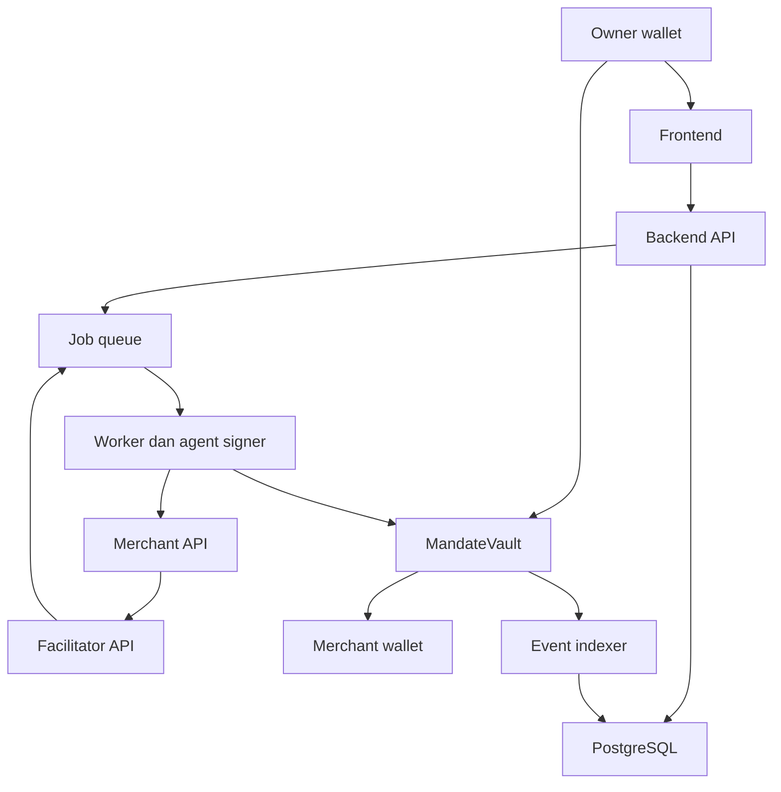
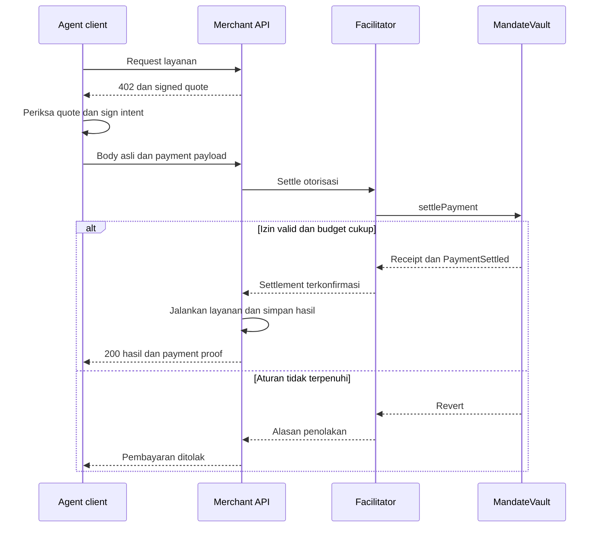
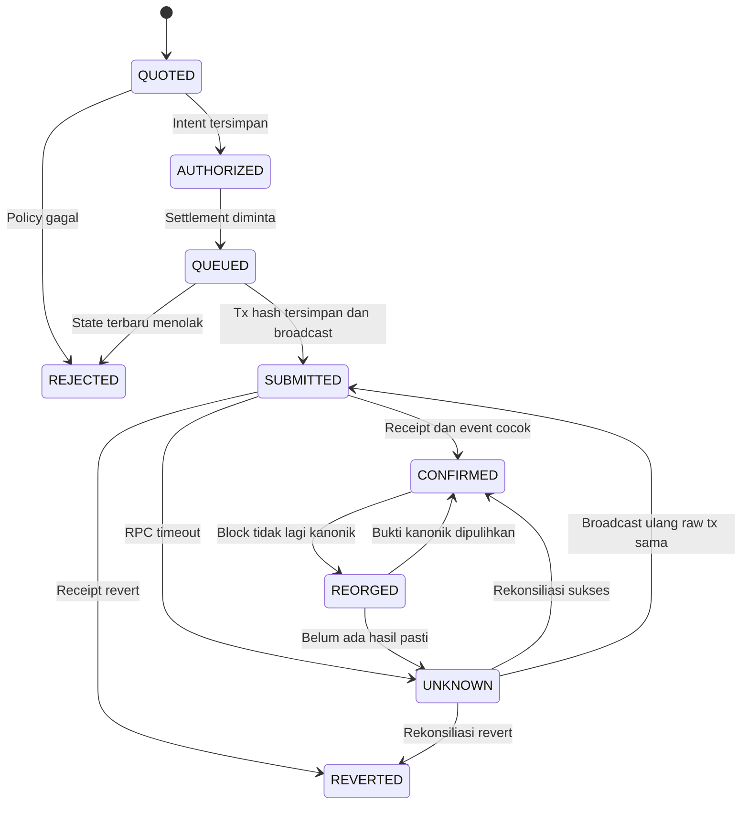

# MandatePay — PRD & Blueprint Implementasi

Versi: 1.1  
Tanggal: 21 September 2026  
Bahasa: Indonesia; nama kode dan API menggunakan bahasa Inggris  
Target: MVP hackathon Finance & Commerce, BNB Smart Chain Testnet  
Status: spesifikasi untuk dibangun; bukan aplikasi yang sudah diimplementasikan, diuji, atau diaudit.

> MandatePay memberi AI agent kemampuan membeli layanan digital dengan anggaran, penerima, dan masa berlaku yang ditentukan pemilik. Smart contract memeriksa otorisasi serta mengurangi anggaran dalam transaksi pembayaran yang sama.

Dokumen ini adalah sumber keputusan produk dan kontrak antarkomponen. AI coding agent harus mengerjakannya bertahap, menghasilkan bukti pada setiap milestone, dan tidak mengganti persyaratan yang sulit dengan simulasi tersembunyi.

## Daftar isi

1. [Ringkasan dan keputusan utama](#1-ringkasan-dan-keputusan-utama)
2. [Tujuan produk, pengguna, dan scope](#2-tujuan-produk-pengguna-dan-scope)
3. [User stories dan acceptance criteria](#3-user-stories-dan-acceptance-criteria)
4. [Arsitektur sistem dan batas kepercayaan](#4-arsitektur-sistem-dan-batas-kepercayaan)
5. [Stack dan kebijakan dependensi](#5-stack-dan-kebijakan-dependensi)
6. [Struktur repository](#6-struktur-repository)
7. [Model domain dan aturan nilai](#7-model-domain-dan-aturan-nilai)
8. [Spesifikasi smart contract](#8-spesifikasi-smart-contract)
9. [Integrasi x402 MandatePay](#9-integrasi-x402-mandatepay)
10. [Backend, database, dan API](#10-backend-database-dan-api)
11. [Agent runner, signer, dan layanan merchant](#11-agent-runner-signer-dan-layanan-merchant)
12. [Frontend dan alur pengguna](#12-frontend-dan-alur-pengguna)
13. [Settlement, retry, indexer, dan recovery](#13-settlement-retry-indexer-dan-recovery)
14. [Keamanan dan batas klaim produk](#14-keamanan-dan-batas-klaim-produk)
15. [Konfigurasi, local development, dan deployment](#15-konfigurasi-local-development-dan-deployment)
16. [Pengujian dan definition of done](#16-pengujian-dan-definition-of-done)
17. [Tahapan eksekusi untuk AI coding agents](#17-tahapan-eksekusi-untuk-ai-coding-agents)
18. [Prompt implementasi dan format handoff](#18-prompt-implementasi-dan-format-handoff)
19. [Demo, metrik, dan dokumen submission](#19-demo-metrik-dan-dokumen-submission)
20. [Referensi serta keputusan yang perlu diverifikasi](#20-referensi-serta-keputusan-yang-perlu-diverifikasi)

## 1. Ringkasan dan keputusan utama

### 1.1 Produk yang dibangun

MVP adalah aplikasi pengendalian pengeluaran AI agent untuk membeli satu jenis layanan digital: pemeriksaan konsistensi invoice terstruktur. Pengguna membuat vault, menyetor token uji, membuat mandat terbatas, lalu meminta agent memeriksa invoice melalui API berbayar.

Layanan merchant benar-benar memeriksa subtotal, diskon, pajak, dan total invoice yang dikirim. AI planner memahami permintaan pengguna serta mengusulkan pemanggilan layanan. Angka pembayaran, tanda tangan, keputusan izin, dan perubahan saldo tidak diserahkan kepada model bahasa.

### 1.2 Keputusan arsitektur yang mengikat

| ID | Keputusan |
|---|---|
| ADR-01 | Jaringan MVP hanya BSC Testnet, chain ID 97. Local development menggunakan Anvil 31337. |
| ADR-02 | Satu token ERC-20 uji buatan proyek, `DemoUSD` / `mUSD`, 6 desimal. Bukan stablecoin bernilai riil. |
| ADR-03 | Satu `MandateVault` per owner per factory. Factory membuat kontrak penuh melalui `new`, tanpa proxy dan tanpa upgrade. |
| ADR-04 | Vault menerima satu token immutable. Setiap mandat mengalokasikan sebagian saldo sebagai anggaran tersendiri. |
| ADR-05 | Owner wallet menandatangani pengaturan dana. Agent memakai delegated EOA signer berbeda. Relayer hanya membayar gas settlement. |
| ADR-06 | `settlePayment` melakukan validasi, deduplikasi, pengurangan anggaran, dan transfer token secara atomik. |
| ADR-07 | Integrasi memakai transport x402 v2 dan **skema kustom `mandatepay`**. Ini bukan implementasi drop-in skema `exact`. |
| ADR-08 | Merchant demo, client, dan facilitator sama-sama mengimplementasikan skema tersebut. Provider x402 umum belum otomatis kompatibel. |
| ADR-09 | Database menyimpan metadata dan proyeksi. Status pembayaran akhir harus berasal dari receipt/event kontrak yang terkonfirmasi. |
| ADR-10 | Payment settlement dan pengiriman hasil layanan mempunyai status terpisah. Berhasil membayar tidak membuktikan hasil layanan sudah diterima. |
| ADR-11 | x402 memakai flow `upfront`: settle dulu, kemudian jalankan layanan. Keputusan ini harus terlihat pada payment requirements dan UI. |
| ADR-12 | MVP tidak menyertakan QRIS, konversi rupiah, bridge, routing lintas chain, yield, RWA, token investasi, atau kredit. |
| ADR-13 | Tidak ada ERC-4337/paymaster/passkey dalam jalur wajib MVP. Relayer mensponsori settlement; owner tetap menyiapkan tBNB untuk setup dan recovery. |
| ADR-14 | Semua contoh biaya, saldo, dan transaksi demo menggunakan token uji. Tidak ada janji hasil investasi atau peluang kemenangan hackathon. |

### 1.3 Mengapa menggunakan skema x402 khusus

Menambahkan pemeriksaan budget di backend lalu menggunakan jalur transfer token lain dapat membuat batas on-chain terlewati. Validasi tanda tangan yang bersifat read-only juga tidak cukup untuk memperbarui akumulasi pengeluaran.

Desain ini menetapkan satu jalur pengeluaran agent: `MandateVault.settlePayment`. Client dan facilitator meneruskan otorisasi pembayaran ke fungsi tersebut. Vault tidak memberikan allowance ke Permit2, tidak menyediakan arbitrary execution, dan tidak mengimplementasikan jalur transfer agent alternatif.

Konsekuensinya: merchant harus memasang adapter MandatePay. Tuliskan ini sebagai batas interoperabilitas. Klaim yang diperbolehkan adalah **“custom x402 v2 payment scheme with on-chain spending mandates on BSC Testnet”**, setelah interoperability tests lulus. Sebelum itu gunakan label **“adapter x402 sedang dikembangkan”**.

Spesifikasi x402 memisahkan transport, scheme, dan mekanisme settlement. Pilihan custom scheme merupakan keputusan proyek, bukan fitur resmi bernama MandatePay. [Spesifikasi x402 v2](https://github.com/x402-foundation/x402/blob/main/specs/x402-specification-v2.md)

## 2. Tujuan produk, pengguna, dan scope

### 2.1 Masalah yang hendak diuji

Hipotesis: pengembang/tim yang sudah memakai dana on-chain ingin agent membeli API tanpa persetujuan setiap transaksi, sambil membatasi risiko dana yang dapat digunakan oleh delegated signer.

Hipotesis ini belum sama dengan validasi pasar. Sebelum memperluas scope, wawancarai sedikitnya tiga calon pengguna; catat cara mereka membeli API sekarang, frekuensi kebutuhan, dan apakah pembayaran token menambah atau mengurangi kesulitan.

### 2.2 Persona dan kewenangan

| Persona | Kebutuhan | Kewenangan MVP |
|---|---|---|
| Owner | Membatasi dana yang boleh dipakai agent | Membuat vault, deposit, membuat/pause/revoke mandat, menarik dana bebas |
| Agent | Membeli layanan untuk tugas yang diberikan | Menandatangani intent memakai delegated key; hanya efektif dalam mandat |
| Merchant | Menjual pemeriksaan invoice per request | Menandatangani invoice pembayaran; menerima token; menyajikan hasil |
| Relayer operator | Mengirim settlement tanpa tBNB pada agent | Membayar gas dan menyiarkan otorisasi yang sudah valid; tidak mengubah penerima/jumlah |
| Observer | Memeriksa demo dan bukti | Membaca data demo publik yang sudah disanitasi dan explorer |

Satu owner boleh memiliki banyak agent dan mandat. Kolaborasi anggota organisasi, multisig UI, dan RBAC perusahaan merupakan fase lanjutan. MVP tidak mengasumsikan satu session aplikasi boleh mengakses semua vault.

### 2.3 Scope P0, P1, dan di luar MVP

| Prioritas | Fitur |
|---|---|
| P0 | Login dengan tanda tangan wallet; validasi network; vault dan deposit |
| P0 | Mandat: agent, pasangan merchant/service yang diizinkan, total budget, daily cap, per-payment cap, jumlah pembayaran, waktu berlaku |
| P0 | Pause/resume, revoke, penutupan mandat kedaluwarsa, withdraw dana bebas |
| P0 | Satu API merchant berbayar yang benar-benar menjalankan validasi invoice |
| P0 | HTTP 402 negotiation, signed merchant invoice, signed agent intent, settlement kontrak |
| P0 | Dashboard budget, activity, bukti receipt, status delivery, retry aman |
| P0 | LLM planner adapter dan fixture planner berlabel jelas; mode live memerlukan konfigurasi provider |
| P0 | Pengujian replay, concurrent spending, revocation, expiry, salah domain, dan recovery |
| P1 | Dua merchant untuk membandingkan penawaran; export aktivitas; sesi demo publik terpisah |
| Lanjutan | Integrasi scheme x402 lain, smart wallet/passkey, ERC-4337, session-key ecosystem, batch settlement |
| Di luar | QRIS, fiat off-ramp, mainnet, yield, RWA, bridge, marketplace, autonomous trading |

### 2.4 Indikator keberhasilan

Target internal, bukan klaim performa yang sudah diukur:

- Pengguna uji dapat membuat mandat dan menyelesaikan satu tugas dengan panduan singkat.
- Seluruh negative tests P0 menolak pembayaran yang tidak diizinkan.
- Retry logis yang sama menghasilkan paling banyak satu pembayaran sukses.
- Dashboard membedakan `submitted`, `confirmed`, dan `delivered`.
- Bisa merekonstruksi status pembayaran setelah restart worker tanpa transfer ulang.
- Demo BSC Testnet memperlihatkan transaksi nyata token uji dan alamat kontrak terverifikasi.
- Ukur latency aktual settlement, termasuk median dan p95, lalu laporkan kondisi pengukuran. Jangan menjanjikan “instant”.

## 3. User stories dan acceptance criteria

| ID | User story | Acceptance criteria utama |
|---|---|---|
| FR-01 | Owner login menggunakan wallet | Nonce sekali pakai, domain/URI/chain cocok, session aman, signature salah ditolak |
| FR-02 | Owner membuat vault | `VaultCreated` dikonfirmasi; owner/token cocok; double creation ditolak factory |
| FR-03 | Owner deposit | Allowance tepat ke vault; `Deposited` dan saldo on-chain naik sesuai nilai |
| FR-04 | Owner membuat mandat | Budget berasal dari saldo bebas; parameter invalid ditolak kontrak; izin tampil sebelum tanda tangan |
| FR-05 | Owner menjalankan agent | Worker hanya menggunakan agent dan mandat milik owner; status mandat diverifikasi |
| FR-06 | Merchant meminta pembayaran | Mengembalikan x402 v2 requirements dengan quote bertanda tangan dan expiry |
| FR-07 | Agent membayar | Token diterima merchant dan budget berkurang dalam transaksi yang sama |
| FR-08 | Sistem menolak overspend | Per-tx, per-day, total budget, dan max-payments ditegakkan kontrak |
| FR-09 | Owner pause/revoke | Pause menahan eksekusi; revoke permanen membebaskan sisa alokasi setelah konfirmasi |
| FR-10 | Retry setelah timeout | Rekonsiliasi hash/receipt dilakukan sebelum membuat pengiriman baru |
| FR-11 | Pengguna membaca hasil | `paid` dan `delivered` dipisah; hasil hanya diberikan kepada client terautentikasi |
| FR-12 | Owner menarik dana | Hanya saldo bebas; dana mandat aktif/paused tidak boleh ditarik diam-diam |
| FR-13 | Observer memverifikasi | Tautan explorer dan nilai receipt cocok; tanpa invoice privat atau signature aktif |
| FR-14 | Worker/indexer restart | Resume dari state durable; tidak ada duplikasi pengeluaran |
| FR-15 | Merchant mengubah penawaran | Jumlah, merchant, token, requestHash, service, chain, dan vault terikat secara kriptografis |
| FR-16 | Dua request berjalan bersamaan | Kontrak tidak melewati budget; DB tidak menandai keduanya berhasil jika salah satu revert |

### 3.1 Contoh demo tetap

- Owner menyetor 100 mUSD, yaitu `100000000` unit atomik.
- Mandat mengalokasikan 10 mUSD, daily cap 1 mUSD, per-payment cap 0,10 mUSD, maksimum 100 pembayaran.
- Merchant `invoice-check` mengenakan 0,02 mUSD = `20000` unit.
- Setelah satu pembayaran sukses: saldo vault 99,98; sisa alokasi 9,98; saldo bebas tetap 90 mUSD.
- Request kedua sebesar 0,20 mUSD ditolak per-payment cap.
- Replay pembayaran pertama tidak mengurangi saldo lagi.
- Setelah revoke dikonfirmasi: sisa alokasi 9,98 dilepas; seluruh saldo 99,98 mUSD menjadi bebas jika tidak ada mandat lain.

## 4. Arsitektur sistem dan batas kepercayaan

### 4.1 Komponen



`Facilitator API` adalah modul backend API, bukan layanan kelima yang wajib di-deploy. `Event indexer` berjalan pada worker. Merchant API sengaja dipisah agar batas seller/client dapat diuji.

### 4.2 Proses yang dideploy

| Proses | Port lokal | Peran |
|---|---:|---|
| `apps/web` | 3000 | Next.js UI, wallet connection, API client |
| `apps/api` | 3001 | Session, REST API, SSE, facilitator routes, enqueue jobs |
| `apps/merchant-demo` | 3002 | Signed quote, paid invoice-check API, durable delivery cache |
| `apps/worker` | 3003 untuk health | Agent runner, signing, relayer, receipt watcher, indexer |
| PostgreSQL | 5432 | Dua database logis: aplikasi dan merchant |
| Redis | 6379 | Queue dan rate limit; bukan sumber kebenaran pembayaran |
| Anvil | 8545 | Blockchain lokal untuk integration tests |

### 4.3 Pembagian sumber kebenaran

| Data | Sumber kebenaran |
|---|---|
| Owner vault, izin mandat, anggaran terpakai, revoke | Smart contract |
| Token sudah berpindah | Receipt sukses dan event kontrak yang cocok pada chain kanonik |
| Task pengguna, label agent, metadata invoice | Database aplikasi |
| Harga quote dan payload layanan | Database merchant, dengan signed quote untuk integritas harga |
| Hasil layanan sudah tersedia | Delivery record merchant + hasil yang berhasil diambil client |
| Antrian pekerjaan | PostgreSQL outbox; Redis menjadi transport yang dapat dibangun ulang |
| Rekomendasi tool dari AI | Usulan tidak tepercaya; harus divalidasi executor |

### 4.4 Batas kepercayaan eksplisit

- Owner mengontrol root wallet. Server tidak pernah meminta seed phrase atau private key owner.
- Operator worker memegang delegated agent key yang dapat membelanjakan dana **dalam mandat**. Jangan mengatakan operator sama sekali tidak memiliki kewenangan menggunakan dana.
- Kompromi agent key dapat menghabiskan seluruh sisa anggaran yang diizinkan, melalui merchant yang diizinkan. Batas budget mengurangi dampak, bukan menghilangkannya.
- Relayer dapat menunda atau menghentikan layanan. Relayer tidak dapat mengubah quote/intention valid, karena signature diverifikasi kontrak.
- Merchant dipercaya memberikan layanan sesuai janji. Bukti pembayaran bukan bukti kualitas atau keberhasilan hasil layanan.
- RPC/indexer bisa terlambat atau gagal. Status “unknown/pending” harus dipertahankan sampai rekonsiliasi.
- Owner dapat revoke atau menarik saldo bebas melalui explorer/script jika UI/backend berhenti berfungsi.

## 5. Stack dan kebijakan dependensi

### 5.1 Stack yang dipilih

| Area | Pilihan | Alasan |
|---|---|---|
| Bahasa web/backend | TypeScript strict | DTO dan domain types dipakai bersama |
| Workspace | pnpm workspaces | Satu lockfile; package boundaries jelas |
| Frontend | Next.js App Router + React | UI dan routing; transaksi wallet pada client components |
| Styling | Tailwind CSS + komponen aksesibel | Mempercepat UI dengan struktur konsisten |
| Wallet | wagmi + viem | Connect, chain switching, typed data, contract calls |
| Server state | TanStack Query | Fetch, invalidation, polling status |
| Backend | Fastify | API schema, modular service, Pino logging |
| Validasi | Zod | Input parsing dan shared contracts |
| Database | PostgreSQL + Prisma | Constraint, transaksi lokal, migration |
| Queue | Redis + BullMQ | Job retries; ketahanan tetap memakai state PostgreSQL |
| Contract | Solidity + Foundry | Unit, fuzz, invariant, deployment |
| Library Solidity | OpenZeppelin Contracts 5.x yang kompatibel dengan compiler terkunci | ERC20, SafeERC20, ECDSA, EIP712, ReentrancyGuard |
| x402 | Transport v2 + adapter skema kustom proyek | Budget settlement tetap di vault |
| Auth | SIWE atau implementasi standar EIP-4361 menggunakan library terawat | Login membuktikan kontrol wallet |
| Testing | Vitest, Fastify inject, Playwright, Foundry | Unit dan integrasi batas keamanan |
| AI | `PlannerProvider` interface + satu provider live | Model dapat diganti tanpa mengubah settlement |

Tidak wajib memakai framework agent besar. Satu planner dengan output JSON terstruktur dan executor deterministik cukup untuk MVP.

### 5.2 Jangan mengarang versi paket

Pada M0, pilih Node LTS yang didukung bersama oleh Next.js/Fastify dan paket lain. Target awal Node 22; bila dukungan aktual memerlukan perubahan, catat pada `docs/DEPENDENCIES.md` sebelum instalasi. Pilih release stabil yang mendapat patch keamanan, bukan canary.

Agent wajib mencatat versi patch **yang benar-benar diinstal**, alasan kompatibilitas, dan sumber dokumentasi. Commit `pnpm-lock.yaml`; gunakan exact package versions, `packageManager` exact, `.node-version`, serta commit/tag dependency Solidity yang tetap. Jangan menulis “latest” pada runtime/release reproducible.

Solidity target awal `0.8.28`, `evm_version = "paris"`, optimizer aktif 200 runs; gunakan `ReentrancyGuard` biasa, bukan varian transient. Jika versi OpenZeppelin yang dipilih memerlukan compiler/EVM lebih baru, gunakan release kompatibel atau revisi matriks compiler secara eksplisit; jangan mengandalkan default toolchain.

Versi dalam paragraf sebelumnya adalah baseline desain, bukan klaim versi terbaru. `forge build`, signing vectors, dan smoke test chain adalah gate kompatibilitas.

Referensi instalasi: [Next.js](https://nextjs.org/docs/app/getting-started/installation), [Fastify LTS](https://fastify.dev/docs/latest/Reference/LTS/), [OpenZeppelin ERC20](https://docs.openzeppelin.com/contracts/5.x/api/token/erc20).

## 6. Struktur repository

Semua path pada tabel relatif terhadap root repository `mandatepay/`. Tabel adalah target struktur yang harus dibuat, bukan daftar file yang sudah tersedia. Gunakan path dengan huruf kecil, kecuali nama kontrak dan dokumen.

### 6.1 Root dan shared packages

| Path | Tanggung jawab |
|---|---|
| `package.json` | Root scripts pada bagian 15; exact packageManager |
| `pnpm-workspace.yaml` | `apps/*`, `packages/*` |
| `pnpm-lock.yaml` | Lockfile tunggal |
| `tsconfig.base.json` | Strict, noUncheckedIndexedAccess, shared compiler config |
| `eslint.config.mjs` | Aturan TypeScript, import boundaries, no unsafe any |
| `.node-version` | Node patch yang sudah diverifikasi |
| `.gitignore` | Env, keys, encrypted local keystore, out/cache, artifacts privat |
| `.env.example` | Nama konfigurasi tanpa nilai rahasia |
| `compose.yaml` | PostgreSQL, Redis, Anvil lokal; ports bind localhost |
| `README.md` | Quickstart, demo, maturity, known limits |
| `AGENTS.md` | Kontrak kerja AI agents dari bagian 18 |
| `docs/PRD_BLUEPRINT.md` | Salinan dokumen ini |
| `docs/UI_DESIGN_SPEC.md` | Copy, visual system, marketing landing, application UI, responsive, accessibility, dan frontend acceptance criteria |
| `docs/DEPENDENCIES.md` | Versi exact dan hasil compatibility spike |
| `docs/PROGRESS.md` | Milestone, bukti command, blockers, next task |
| `docs/adr/` | Alasan perubahan arsitektur; tidak mengganti keputusan diam-diam |
| `docs/protocol/mandatepay-v1.md` | Wire protocol dan custom scheme, termasuk failure semantics |
| `docs/THREAT_MODEL.md` | Batas kepercayaan dan kontrol yang benar-benar ada |
| `docs/DEMO.md` | Skenario dan proof links |
| `packages/shared/src/domain/` | Enum/domain types tanpa React, Prisma, atau secrets |
| `packages/shared/src/schemas/` | Zod schemas API dan protokol |
| `packages/shared/src/money.ts` | Parsing decimal string ke bigint; format untuk UI |
| `packages/shared/src/ids.ts` | Request IDs, invoice IDs, canonical hashing |
| `packages/shared/src/errors.ts` | Error codes stabil |
| `packages/shared/src/limits.ts` | Batas body, header, task, deadline |
| `packages/chain/src/abi/` | ABI generated dari Foundry; dilarang edit manual |
| `packages/chain/src/deployments/` | Manifest publik per chain |
| `packages/chain/src/typed-data.ts` | EIP-712 types dan domain builders |
| `packages/chain/src/vault-client.ts` | Read/simulate/encode calls typed |
| `packages/chain/src/error-decoder.ts` | Revert ke error produk |
| `packages/x402-mandate/src/codec.ts` | Encode/decode header v2, bounds check |
| `packages/x402-mandate/src/client.ts` | Negotiate quote dan buat payload |
| `packages/x402-mandate/src/server.ts` | Payment-required dan response adapter |
| `packages/x402-mandate/src/facilitator.ts` | Pure validation interface; side effects di worker |
| `packages/x402-mandate/src/schemas.ts` | Payload khusus `mandatepay` |
| `packages/x402-mandate/test/fixtures/` | Golden envelopes valid/invalid |
| `packages/db/prisma/schema.prisma` | Model database aplikasi |
| `packages/db/prisma/migrations/` | Migration termasuk unique/check constraints |
| `packages/db/src/client.ts` | Server-only Prisma client |
| `packages/db/src/repositories/` | Scoped queries dan transisi state |
| `packages/config/src/server-env.ts` | Server env validation; fail closed |
| `packages/config/src/public-env.ts` | Allowlist konfigurasi publik |
| `scripts/doctor.ts` | Verifikasi deps, services, chainId, manifests |
| `scripts/export-contracts.ts` | ABI + manifest; jangan memasukkan private key |
| `scripts/seed-local.ts` | Seed deterministik untuk local chain |
| `scripts/seed-testnet.ts` | Seed token uji dengan wallet deployment terpisah |
| `scripts/reconcile.ts` | Recovery satu pembayaran secara read-first |
| `scripts/verify-release.ts` | Gates rilis, env completeness, build metadata |
| `tests/e2e/` | User flow dan retry end-to-end |
| `.github/workflows/ci.yml` | Typecheck, contract tests, integrations, build |

### 6.2 Frontend

| Path di `apps/web/` | Tanggung jawab |
|---|---|
| `src/app/layout.tsx` | Providers dan shell |
| `src/app/page.tsx` | Penjelasan manfaat, status testnet, tombol masuk |
| `src/app/(app)/dashboard/page.tsx` | Saldo, allocated/free, spending, latest activity |
| `src/app/(app)/vault/page.tsx` | Create, deposit, withdraw |
| `src/app/(app)/agents/page.tsx` | Daftar dan provisioning agent signer |
| `src/app/(app)/mandates/new/page.tsx` | Form mandat dengan review izin |
| `src/app/(app)/mandates/[id]/page.tsx` | Limits, usage, pause/resume/revoke |
| `src/app/(app)/runs/new/page.tsx` | Input invoice dan tugas agent |
| `src/app/(app)/runs/[id]/page.tsx` | Timeline pembayaran dan hasil |
| `src/app/(app)/payments/[id]/page.tsx` | Quote, policy checks, receipt, delivery |
| `src/app/(app)/activity/page.tsx` | Filter dan riwayat |
| `src/app/demo/page.tsx` | Data demonstrasi yang sudah disanitasi |
| `src/components/wallet/` | Connect, wrong-network guard, transaction progress |
| `src/components/mandates/` | Form, permission summary, remaining budget |
| `src/components/payments/` | Status badge, policy checks, explorer proof |
| `src/components/runs/` | Task form, execution timeline, result panel |
| `src/components/ui/` | Komponen presentasi aksesibel |
| `src/hooks/use-vault.ts` | Query on-chain dan reconciliation hints |
| `src/hooks/use-mandate.ts` | Pembacaan state kontrak |
| `src/hooks/use-run-events.ts` | SSE reconnect dan query invalidation |
| `src/lib/api-client.ts` | Cookie auth, CSRF, error mapping |
| `src/lib/wallet-config.ts` | Wagmi chain 97/31337, connectors |
| `src/lib/query-keys.ts` | Keys selalu berisi wallet/chain saat relevan |
| `src/lib/format.ts` | Display token/time tanpa arithmetic float |

### 6.3 Backend, worker, dan merchant

| Path | Tanggung jawab |
|---|---|
| `apps/api/src/app.ts` | Fastify builder injectable untuk tests |
| `apps/api/src/server.ts` | Bootstrap dan shutdown |
| `apps/api/src/plugins/` | Env, DB, auth, CSRF, rate limit, logger |
| `apps/api/src/modules/auth/` | SIWE nonce, verify, session, logout |
| `apps/api/src/modules/vaults/` | Metadata, on-chain verification, prepared calldata |
| `apps/api/src/modules/agents/` | Provision jobs, public agent address |
| `apps/api/src/modules/mandates/` | Draft, encode calls, confirmed projection |
| `apps/api/src/modules/runs/` | Create task, cancel, SSE, results |
| `apps/api/src/modules/payments/` | Status, proof, retry reconciliation |
| `apps/api/src/modules/facilitator/` | `/supported`, `/verify`, `/settle` dan auth merchant |
| `apps/api/src/modules/health/` | Readiness dependency dan worker lag |
| `apps/worker/src/main.ts` | Queue consumers, indexer, scheduler |
| `apps/worker/src/jobs/` | Typed job handlers tanpa logic di controller |
| `apps/worker/src/agent/planner.ts` | Planner interface, live/fixture adapter |
| `apps/worker/src/agent/executor.ts` | Tool allowlist, quote validation, steps |
| `apps/worker/src/agent/policy-preflight.ts` | UX check; kontrak tetap authority |
| `apps/worker/src/signers/agent-signer.ts` | Decrypt key, sign typed intent; server-only |
| `apps/worker/src/signers/relayer-signer.ts` | Sign transaction gas; key berbeda |
| `apps/worker/src/signers/keystore.ts` | AES-GCM per-agent key storage |
| `apps/worker/src/settlement/relayer.ts` | Nonce reservation, persist raw tx, broadcast |
| `apps/worker/src/settlement/reconciler.ts` | Receipt, replacement, timeout handling |
| `apps/worker/src/indexer/` | Factory/vault event ingestion dan reorg recovery |
| `apps/merchant-demo/src/app.ts` | Fastify merchant server |
| `apps/merchant-demo/src/quote-service.ts` | Stable request binding + EIP-712 merchant quote |
| `apps/merchant-demo/src/payment-gate.ts` | Upfront settle, auth, cache, replay handling |
| `apps/merchant-demo/src/services/invoice-check.ts` | Pemeriksaan invoice aktual |
| `apps/merchant-demo/src/result-service.ts` | Durable result dan redelivery |
| `apps/merchant-demo/prisma/schema.prisma` | DB merchant tersendiri |
| `apps/merchant-demo/src/demo-faults.ts` | Fault injection hanya local/demo, bukan public arbitrary endpoint |

### 6.4 Smart contract

| Path di `contracts/` | Tanggung jawab |
|---|---|
| `foundry.toml` | Compiler, optimizer, EVM target, invariant runs |
| `remappings.txt` | OpenZeppelin path yang terkunci |
| `src/MandateVault.sol` | Semua aturan dana dan mandat |
| `src/VaultFactory.sol` | Deploy satu vault per owner; immutable token |
| `src/demo/DemoUSD.sol` | Token uji 6 desimal; faucet terbatas testnet |
| `src/interfaces/IMandateVault.sol` | Struct, interface, event, error canonical |
| `test/unit/` | Pengujian per fungsi dan custom errors |
| `test/fuzz/` | Boundary dan fuzz input |
| `test/invariant/` | Accounting dan otorisasi lintas urutan aksi |
| `test/helpers/` | Sign quote/intent, actors, fixture |
| `script/Deploy.s.sol` | Deploy token/factory; larang chain 56 pada konfigurasi MVP |
| `script/OwnerRecovery.s.sol` | Revoke/close/withdraw dengan owner signer |

Aturan import: frontend boleh mengimpor `shared`, bagian publik `chain`, dan codec murni. Frontend tidak boleh mengimpor `db`, `server-env`, atau signer. `shared` tidak mengimpor aplikasi. Worker tidak memanggil route internal lewat HTTP jika service/repository lokal tersedia.

## 7. Model domain dan aturan nilai

### 7.1 Entity

| Entity | Definisi |
|---|---|
| Owner | Alamat wallet yang memiliki vault |
| Vault | Kontrak penampung satu jenis token dengan owner immutable |
| Agent | Identitas aplikasi + delegated signer EOA |
| Mandate | Alokasi dana dan izin immutable; status dapat pause/revoke/close |
| Provider permission | Pasangan alamat merchant dan `serviceId` yang diizinkan |
| Run | Satu tugas yang diminta pengguna |
| Step/request | Satu pembelian layanan logis di dalam run |
| Merchant invoice | Quote pembayaran yang ditandatangani merchant untuk request tertentu |
| Payment intent | Persetujuan agent untuk membayar satu invoice dalam mandat |
| Payment | Logical settlement record, dapat memiliki beberapa tx attempts |
| Delivery | Status hasil layanan setelah pembayaran |

### 7.2 Identifier dan representasi

- UUID untuk ID database. ID kontrak menggunakan `bytes32` acak dari CSPRNG.
- `mandateId`, `requestId`, `invoiceId` dihasilkan sekali dan disimpan sebelum side effect; jangan dibuat ulang saat retry.
- `serviceId = keccak256(UTF8("invoice-check:v1"))`.
- `requestHash = keccak256(UTF8(JCS(canonicalInput)))`, memakai JSON Canonicalization Scheme RFC 8785. `canonicalInput` selalu object `{ method: "POST", path: "/v1/services/invoice-check", body: normalizedRequestBody }`, sesuai bagian 11.6. Batasi data ke string, boolean, integer aman, array, object; nilai moneter adalah string integer.
- Hash request tidak menyertakan credential atau PAYMENT-SIGNATURE. Payload canonical mencakup `requestId`, `mandateId`, `serviceId`, data invoice, serta identifier input; kedua pihak menghitung sendiri.
- Alamat disimpan lowercase untuk constraint; display menggunakan checksum. Validasi alamat 20 byte; zero address ditolak.
- Semua nilai token berbentuk `bigint` pada kode domain/Solidity, string desimal integer pada JSON, dan `NUMERIC(78,0)` pada PostgreSQL.
- Jangan memakai `Number`, `parseFloat`, atau bilangan pecahan JavaScript untuk arithmetic pembayaran. Unix seconds dibatasi uint64; tampilan tanggal boleh menggunakan konversi yang range-checked.
- Invoice bisnis juga memakai unit minor dalam string; denominasi bisnis invoice tidak mengubah token biaya layanan.

### 7.3 Batas awal

| Parameter | Nilai MVP |
|---|---|
| Token decimals | 6 |
| Provider permissions per mandate | 1–20 pasangan unik |
| Active run steps | Maksimum 3; demo utama cukup 1 |
| Quote TTL | 120 detik |
| Max mandate duration | 30 hari; ditegakkan saat create |
| Daily window | Hari UTC: `block.timestamp / 86400` |
| HTTP body invoice | 32 KiB; maksimal 100 line items |
| Decoded payment header | 8 KiB maksimum; gateway mendukung total header >= 16 KiB |
| Chain confirmations | Local 1; BSC Testnet default 3, configurable |
| Receipt wait pada satu HTTP request | 8 detik; setelah itu pending |
| Polling UI fallback | 3 detik saat pending; berhenti/backoff pada status terminal |

Daily cap merupakan calendar-day cap, bukan rolling 24 jam. Pengeluaran dekat pergantian hari dapat menggunakan dua jatah harian; jelaskan di form.

## 8. Spesifikasi smart contract

### 8.1 VaultFactory

Constructor menerima alamat token demo yang bukan zero address, mempunyai bytecode, dan decimals 6. Token immutable dan tidak dapat diganti. Constructor vault juga memvalidasi owner/token nonzero. Pengecekan interface tidak membuktikan perilaku token; deployment manifest hanya memakai DemoUSD yang dibangun dari source proyek.

```solidity
interface IVaultFactory {
    event VaultCreated(address indexed owner, address indexed vault, address token);
    function createVault() external returns (address vault);
    function vaultOf(address owner) external view returns (address);
    function token() external view returns (address);
}
```

`createVault()` menetapkan owner sebagai `msg.sender`, menolak owner yang sudah mempunyai vault pada factory itu, menjalankan `new MandateVault(msg.sender, token)`, menyimpan mapping, lalu emit event. Tidak ada `createVaultFor` pada MVP agar masalah pemilihan owner tidak melebar.

Satu owner masih dapat membuat vault di factory lain; UI dan API hanya mengakui factory dalam deployment manifest. Jangan mengklaim keunikan vault secara global di seluruh blockchain.

### 8.2 Struct canonical

Kode berikut adalah spesifikasi interface yang harus menjadi sumber untuk ABI dan DTO. Simpan definisi final pada `IMandateVault.sol` lalu generate bindings; jangan menyalin tiga versi yang berbeda.

```solidity
enum MandateStatus { None, Active, Paused, Revoked, Closed }

struct MandateConfig {
    bytes32 mandateId;
    address agent;
    uint256 totalLimit;
    uint256 dailyLimit;
    uint256 perPaymentLimit;
    uint64 validAfter;
    uint64 validUntil;
    uint32 maxPayments;
}

struct ProviderPermission {
    address merchant;
    bytes32 serviceId;
}

struct MandateState {
    MandateConfig config;
    uint256 spentTotal;
    uint32 paymentCount;
    MandateStatus status;
}

struct Invoice {
    bytes32 invoiceId;
    bytes32 requestId;
    bytes32 mandateId;
    bytes32 serviceId;
    bytes32 requestHash;
    address vault;
    address token;
    address merchant;
    uint256 amount;
    uint64 validUntil;
}

struct PaymentIntent {
    bytes32 mandateId;
    bytes32 invoiceDigest;
    uint64 deadline;
}
```

`merchant` merupakan penerima token sekaligus signer invoice pada MVP. Alamat signing terpisah dari payout belum didukung. `agent` merupakan alamat delegated EOA; owner boleh memakai wallet kontrak untuk transaksi owner, tetapi agent dan merchant quote verification pada MVP menggunakan ECDSA EOA.

### 8.3 Interface vault

```solidity
interface IMandateVault {
    function owner() external view returns (address);
    function token() external view returns (address);
    function reservedRemaining() external view returns (uint256);
    function freeBalance() external view returns (uint256);
    function paymentsPaused() external view returns (bool);

    function deposit(uint256 amount) external;
    function withdrawFree(uint256 amount, address recipient) external;
    function createMandate(
        MandateConfig calldata config,
        ProviderPermission[] calldata providers
    ) external;
    function pauseMandate(bytes32 mandateId) external;
    function resumeMandate(bytes32 mandateId) external;
    function revokeMandate(bytes32 mandateId) external;
    function closeExpiredMandate(bytes32 mandateId) external;
    function setPaymentsPaused(bool paused) external;

    function settlePayment(
        Invoice calldata invoice,
        bytes calldata merchantSignature,
        PaymentIntent calldata intent,
        bytes calldata agentSignature
    ) external returns (bytes32 paymentDigest);

    function getMandate(bytes32 mandateId) external view returns (MandateState memory);
    function spentOnDay(bytes32 mandateId, uint256 utcDay) external view returns (uint256);
    function isProviderAllowed(bytes32 mandateId, address merchant, bytes32 serviceId)
        external view returns (bool);
    function paidInvoiceDigest(address merchant, bytes32 invoiceId)
        external view returns (bytes32);
    function paidRequestDigest(address merchant, bytes32 requestId)
        external view returns (bytes32);
    function isIntentConsumed(bytes32 intentDigest) external view returns (bool);
    function hashInvoice(Invoice calldata invoice) external view returns (bytes32);
    function hashIntent(PaymentIntent calldata intent) external view returns (bytes32);
}
```

Interface di atas diasumsikan mengimpor enum/struct canonical pada file yang sama. Kode dokumentasi tidak dimaksudkan sebagai kontrak lengkap yang bisa langsung di-deploy tanpa implementasi.

### 8.4 Ownership dan operasi dana

Owner immutable; MVP tidak menyediakan transfer ownership atau platform admin. `deposit`, `withdrawFree`, create/pause/resume/revoke, dan `setPaymentsPaused` hanya owner. `closeExpiredMandate` permissionless karena hanya membebaskan reservasi dalam vault, tidak memindahkan token keluar.

`deposit(amount)`:

1. `amount > 0`.
2. Transfer dari `msg.sender` ke vault memakai SafeERC20.
3. Pastikan selisih balance tepat sama dengan amount; token fee-on-transfer/rebasing tidak didukung.
4. Emit `Deposited(owner, amount)`.

`withdrawFree(amount, recipient)`:

1. Owner saja, amount positif, recipient bukan zero address atau vault itu sendiri.
2. Pastikan amount tidak melebihi `token.balanceOf(vault) - reservedRemaining`.
3. Transfer dan emit `Withdrawn(recipient, amount)`.

`deposit`, `withdrawFree`, dan `settlePayment` menggunakan `nonReentrant`; jangan memanggil entrypoint guarded dari entrypoint guarded lain. Tidak ada fungsi withdraw reserved funds. Owner harus revoke/close mandat dahulu. Transfer token langsung ke vault dianggap dana bebas; `Deposited` hanya mencatat deposit lewat fungsi resmi. Saldo UI tetap membaca ERC-20 on-chain.

Tidak ada generic ERC-20 rescue atau ETH withdrawal pada MVP. Tolak native transfer normal melalui `receive`/`fallback`; paksa native transfer di luar cakupan. UI hanya menawarkan token resmi manifest.

### 8.5 Validasi createMandate

- ID tidak zero dan belum pernah dipakai, termasuk setelah revoke/close.
- Agent bukan zero address. Sistem signer MVP hanya menghasilkan EOA.
- `0 < perPaymentLimit <= dailyLimit <= totalLimit`.
- `1 <= maxPayments <= 10000`.
- `validUntil > validAfter`, `validUntil > block.timestamp`.
- Durasi `validUntil - validAfter <= 30 days`.
- Satu hingga 20 provider permission; pasangan merchant/service unik, tidak zero.
- `totalLimit <= freeBalance()`.
- State awal `Active`, spent/count nol; `reservedRemaining += totalLimit`.
- Provider list immutable selama mandat. Untuk mengubah agent, limit, atau merchant: revoke lalu buat ID baru.

`validAfter` boleh berada di masa lalu untuk toleransi konfirmasi, tetapi interval valid tetap harus memenuhi seluruh syarat. Status Active sebelum validAfter berarti terdaftar namun belum bisa dipakai; UI menampilkan Scheduled.

### 8.6 Aturan accounting

Untuk setiap mandat yang belum terminal:

```text
remaining(m) = totalLimit(m) - spentTotal(m)
reservedRemaining = sum(remaining(m) untuk status Active atau Paused)
freeBalance = ERC20.balanceOf(vault) - reservedRemaining
```

Mandat yang waktunya telah kedaluwarsa tetap memegang reservasi sampai `closeExpiredMandate` atau `revokeMandate` dikonfirmasi. UI harus menyediakan tombol Release expired allocation. Indexer tidak boleh membebaskan dana hanya karena jam server melewati expiry.

Saat settlement sukses sebesar A:

```text
spentTotal[m] += A
spentOnDay[m][block.timestamp / 86400] += A
paymentCount[m] += 1
reservedRemaining -= A
token.transfer(merchant, A)
```

Dengan demikian freeBalance tidak berubah akibat settlement. Revoke/close melepas `totalLimit - spentTotal` tepat sekali. Tidak ada proses otomatis menambah limit atau mengambil saldo bebas saat budget habis.

Budget harian berlaku per mandat. Dua mandat berbeda mempunyai budget masing-masing; jangan menampilkan daily cap sebagai batas global owner.

### 8.7 Tanda tangan EIP-712

Domain pada semua invoice dan intent:

```json
{
  "name": "MandatePay",
  "version": "1",
  "chainId": 97,
  "verifyingContract": "<alamat-vault-hasil-deployment>"
}
```

Nama tipe dan urutan field harus persis sama di Solidity dan TypeScript:

```text
Invoice(bytes32 invoiceId,bytes32 requestId,bytes32 mandateId,bytes32 serviceId,bytes32 requestHash,address vault,address token,address merchant,uint256 amount,uint64 validUntil)
PaymentIntent(bytes32 mandateId,bytes32 invoiceDigest,uint64 deadline)
```

`invoiceDigest` adalah **digest EIP-712 penuh**, bukan JSON hash atau struct hash. `hashInvoice` menggunakan domain vault dan field lengkap. Agent menandatangani PaymentIntent yang berisi digest tersebut. `paymentDigest` yang dikembalikan settlement sama dengan digest PaymentIntent.

Gunakan OpenZeppelin EIP712 dan ECDSA, bukan merakit recovery signature sendiri. `abi.encode` untuk struct hashing, bukan packed encoding data dinamis. Buat golden vector yang membandingkan `viem.hashTypedData` dengan `hashInvoice/hashIntent` dari kontrak lokal. [OpenZeppelin cryptography](https://docs.openzeppelin.com/contracts/5.x/api/utils/cryptography)

Invoice menyebut vault/token secara eksplisit meskipun domain juga mengikat vault. Kontrak wajib memeriksa keduanya; chain binding diperoleh dari EIP-712 domain, bukan kepercayaan pada HTTP payload.

### 8.8 Urutan settlePayment

Fungsi harus memakai `nonReentrant`. Semua revert membatalkan perubahan counters dan transfer.

1. Pastikan vault payments tidak paused.
2. Ambil mandat; harus ada dan berstatus Active.
3. `validAfter <= block.timestamp < validUntil`.
4. Semua ID wajib tidak zero; invoice.mandateId sama dengan intent.mandateId.
5. Invoice.vault sama dengan address kontrak, token sama dengan immutable token, amount positif, requestHash tidak zero.
6. Pasangan merchant/service terdaftar pada mandat.
7. Waktu sekarang lebih kecil dari invoice.validUntil dan intent.deadline. Intent.deadline tidak boleh lebih besar dari invoice.validUntil atau mandat.validUntil.
8. Hitung invoiceDigest; harus cocok dengan intent.invoiceDigest. Recover merchant signature dan pastikan signer sama dengan invoice.merchant.
9. Recover agent signature menggunakan hashIntent; signer harus sama dengan mandat.agent.
10. Tolak invoice merchant yang sudah dibayar, request merchant yang sudah dibayar, atau intent yang sudah consumed.
11. Pastikan amount <= perPaymentLimit, amount <= sisa total, amount <= sisa daily cap, dan paymentCount < maxPayments.
12. Pastikan saldo token mencukupi dan invariant reservedRemaining tidak defisit.
13. Tandai invoice/request/intent consumed, perbarui total/daily/count, kurangi reservedRemaining.
14. Transfer token tepat ke invoice.merchant menggunakan SafeERC20.
15. Emit PaymentSettled. Return intentDigest.

Kontrak tidak melakukan HTTP, pemanggilan AI, konversi kurs, atau validasi isi dokumen. `requestHash` mengikat isi request yang disepakati, bukan membuktikan kebenaran invoice bisnis.

### 8.9 Deduplikasi dan race

- Invoice key: `keccak256(abi.encode(merchant, invoiceId))`, scope satu vault.
- Request key: `keccak256(abi.encode(merchant, requestId))`, scope satu vault, lintas mandat.
- Simpan digest invoice sebagai nilai mapping, bukan hanya bool; berguna untuk pencocokan saat recovery.
- Intent key: digest EIP-712 intent.
- Dua transaksi bersamaan diproses berurutan oleh EVM. State terbaru diperiksa pada masing-masing eksekusi.
- `eth_call` preflight tidak mereservasi budget. Hasil preflight lolos tidak boleh dianggap pembayaran sukses.
- Revoke efektif setelah masuk chain. Settlement yang lebih dahulu dieksekusi tetap sah; jangan menjanjikan pembatalan transaksi yang sudah selesai.
- Merchant/request ID baru bisa merepresentasikan tagihan bisnis duplikat. Anti-replay bukan deteksi fraud bisnis universal.

### 8.10 Pause, revoke, expiry

| Operasi | State asal | Hasil |
|---|---|---|
| pause | Active | Paused; seluruh sisa reservasi tetap ada |
| resume | Paused dan belum expired | Active |
| revoke | Active atau Paused | Revoked; sisa reservasi dilepas; tidak dapat diaktifkan lagi |
| closeExpired | Active atau Paused, sekarang >= validUntil | Closed; sisa reservasi dilepas |
| setPaymentsPaused(true) | Kapan pun oleh owner | Menahan settlement semua mandat; status mandat tidak berubah |
| setPaymentsPaused(false) | Kapan pun oleh owner | Membuka pemeriksaan settlement normal |

Deposit, revoke, close, dan withdrawFree tetap tersedia saat paymentsPaused. Revoke/close terminal yang dipanggil ulang harus revert; adapter aplikasi cukup membaca state untuk menampilkan selesai.

### 8.11 Events dan custom errors

Events wajib:

```solidity
event Deposited(address indexed owner, uint256 amount);
event Withdrawn(address indexed recipient, uint256 amount);
event MandateCreated(bytes32 indexed mandateId, address indexed agent,
    uint256 totalLimit, uint256 dailyLimit, uint256 perPaymentLimit,
    uint64 validAfter, uint64 validUntil, uint32 maxPayments);
event ProviderAllowed(bytes32 indexed mandateId, address indexed merchant,
    bytes32 indexed serviceId);
event MandateStatusChanged(bytes32 indexed mandateId, uint8 status,
    uint256 releasedAmount);
event PaymentsPauseChanged(bool paused);
event PaymentSettled(bytes32 indexed mandateId, bytes32 indexed invoiceId,
    bytes32 indexed requestId, address agent, address merchant,
    bytes32 serviceId, bytes32 invoiceDigest, bytes32 intentDigest,
    uint256 amount, uint256 totalSpent, uint256 dailySpent, uint256 utcDay);
```

Token/vault/owner diperoleh dari event address dan immutable getters. Tidak ada invoice content, nama orang, atau signature dalam event.

Stable custom errors: `Unauthorized`, `InvalidConfig`, `MandateAlreadyExists`, `MandateNotFound`, `MandateNotActive`, `MandateNotStarted`, `MandateExpired`, `VaultPaymentsPaused`, `ProviderNotAllowed`, `InvalidInvoice`, `InvalidMerchantSignature`, `InvalidAgentSignature`, `AuthorizationExpired`, `InvoiceAlreadyPaid`, `RequestAlreadyPaid`, `IntentAlreadyUsed`, `PerPaymentLimitExceeded`, `DailyLimitExceeded`, `TotalLimitExceeded`, `PaymentCountExceeded`, `InsufficientFreeBalance`, `UnsupportedTokenBehavior`, `MandateNotExpired`, `InvalidStatusTransition`.

Setiap error boleh memiliki argumen context typed, tetapi nama tidak boleh diganti tanpa memperbarui decoder dan tests. Error OpenZeppelin yang merambat harus dipetakan juga. Jangan emit “payment rejected” dalam transaksi yang revert: event tersebut ikut dibatalkan. Penolakan dicatat backend dengan kategori bukti `preflight` atau `onchain_revert`.

### 8.12 Invariants wajib

| ID | Invariant |
|---|---|
| INV-01 | reservedRemaining sama dengan jumlah sisa seluruh mandat nonterminal |
| INV-02 | reservedRemaining <= saldo token vault |
| INV-03 | spentTotal <= totalLimit untuk setiap mandat |
| INV-04 | spentOnDay <= dailyLimit pada hari yang bersangkutan |
| INV-05 | Satu invoice/request key menghasilkan maksimal satu transfer sukses |
| INV-06 | Pembayaran hanya ke merchant/service yang diizinkan dengan dua signature valid |
| INV-07 | Revert tidak mengubah saldo, used flags, atau counters |
| INV-08 | Delegated agent tidak mempunyai jalur withdraw, approve, arbitrary call, atau perubahan limit |
| INV-09 | Pause/revoke/expiry menahan settlement sesuai state saat eksekusi |
| INV-10 | Signatures dari chain/vault lain tidak valid |

### 8.13 Token demo

`DemoUSD` mewarisi ERC-20 OpenZeppelin dengan name `MandatePay Demo USD`, symbol `mUSD`, dan `decimals()` mengembalikan 6. Constructor menolak chain selain 31337 dan 97. Token tidak memiliki nilai riil, fee-on-transfer, rebase, blacklist, proxy, atau admin upgrade.

Expose `faucet()` yang mint `100000000` unit, yaitu 100 mUSD, kepada `msg.sender`. Simpan `nextFaucetAt[address]`; panggilan selanjutnya hanya boleh setelah 24 jam menurut block timestamp. Pemeriksaan dan update dilakukan sebelum mint. Faucet ini sekadar pembatas operasional per address; bukan perlindungan Sybil. Tidak ada public mint lain. Test dapat melakukan time warp atau menggunakan token mock khusus test; test-only mint tidak boleh masuk deployment artifact.

README dan UI harus menyebut bahwa faucet token tidak menyediakan tBNB. Gas owner/relayer testnet harus disiapkan terpisah. Token factory/vault harus cocok dengan alamat pada manifest yang benar.

## 9. Integrasi x402 MandatePay

### 9.1 Kontrak protokol

| Parameter | Nilai |
|---|---|
| x402 version | 2 |
| Scheme proyek | `mandatepay` |
| Scheme version | `1` dalam extra |
| Network | `eip155:97`; local `eip155:31337` |
| Asset | Alamat DemoUSD dari manifest |
| Flow | `upfront` |
| Asset transfer method | `mandate-vault-v1`, identifier privat skema ini |
| Client | Worker dengan delegated signer |
| Resource server | Merchant demo yang opt-in adapter |
| Facilitator | Module API + relayer worker milik proyek |

Transport HTTP menggunakan header x402 v2 `PAYMENT-REQUIRED`, `PAYMENT-SIGNATURE`, dan `PAYMENT-RESPONSE`. Encode JSON UTF-8 dengan base64, bukan URL query. Header names case-insensitive; gunakan serializer yang sama dalam seluruh komponen. [HTTP 402 transport](https://docs.x402.org/core-concepts/http-402)

Skema ini mengharuskan seller dan client berbagi adapter; jangan kirim payload khusus vault dengan label `exact` ke facilitator umum. Tidak ada klaim kompatibilitas token/chain/wallet tanpa test. [Dukungan jaringan dan token x402](https://docs.x402.org/core-concepts/network-and-token-support)

### 9.2 Request resource

Endpoint merchant: `POST /v1/services/invoice-check`.

Request body dibuat worker dari input yang sudah divalidasi:

```json
{
  "requestId": "<bytes32-tetap-untuk-step>",
  "mandateId": "<bytes32-mandat>",
  "vault": "<address-vault>",
  "serviceId": "<keccak256-invoice-check:v1>",
  "invoice": {
    "reference": "INV-DEMO-001",
    "currency": "IDR",
    "items": [{ "description": "Jasa desain", "quantity": "2", "unitPriceMinor": "100000" }],
    "discountMinor": "0",
    "taxMinor": "0",
    "declaredTotalMinor": "200000"
  }
}
```

Label IDR di atas hanya denominasi data invoice yang diperiksa, bukan pembayaran QRIS atau settlement rupiah. Fee layanan tetap mUSD testnet.

Merchant menghitung requestHash sendiri. Body yang sama harus dikirim pada retry; jika hash berubah dengan requestId yang sama, return `409 REQUEST_CONTENT_CHANGED`.

### 9.3 Payment-required response

Tanpa PAYMENT-SIGNATURE, merchant mengembalikan HTTP 402 dan header PAYMENT-REQUIRED berisi base64 dari envelope. Body boleh berisi ringkasan ramah pengguna, tetapi header tetap canonical.

Untuk menghindari contoh seolah-olah merupakan alamat deployment nyata, semua address/ID di contoh adalah placeholder yang harus dihasilkan seed script.

```json
{
  "x402Version": 2,
  "resource": {
    "url": "https://merchant.example/v1/services/invoice-check",
    "description": "Check invoice arithmetic",
    "mimeType": "application/json"
  },
  "accepts": [{
    "scheme": "mandatepay",
    "network": "eip155:97",
    "amount": "20000",
    "asset": "<DemoUSD>",
    "payTo": "<merchant-address>",
    "maxTimeoutSeconds": 120,
    "extra": {
      "schemeVersion": 1,
      "assetTransferMethod": "mandate-vault-v1",
      "paymentFlow": "upfront",
      "vault": "<vault-address>",
      "invoice": "<objek-Invoice-lengkap-sesuai-bagian-8>",
      "merchantSignature": "<signature-hex>"
    }
  }]
}
```

Pada implementation, `extra.invoice` harus object terstruktur, bukan string placeholder. Golden fixture wajib berisi nilai lengkap dan signature yang diverifikasi.

### 9.4 Client validation dan payment payload

Sebelum signing, client wajib memastikan:

1. Version/scheme/flow dikenal; hanya ada pilihan dari jaringan manifest.
2. Resource origin dan path sama dengan katalog service yang trusted; tidak mengikuti URL arbitrary dari response.
3. `amount`, `asset`, `payTo`, dan vault pada requirements persis cocok dengan signed invoice.
4. Mandate ID, requestId, serviceId, requestHash sesuai step yang diminta pengguna.
5. Merchant signature valid; quote belum expired; price dalam cap.
6. Agent signer pada mandat adalah signer job saat ini; mandat milik run owner.
7. Quote TTL tidak melebihi kebijakan client. Deadline intent = minimum(expiry quote, expiry mandat, current time + 120 detik).

PaymentPayload menggunakan top-level `x402Version`, `resource`, `accepted` yang menyalin pilihan requirements, dan `payload` khusus proyek berikut:

```typescript
type MandatePayPayloadV1 = {
  invoice: InvoiceWire;
  merchantSignature: `0x${string}`;
  intent: {
    mandateId: `0x${string}`;
    invoiceDigest: `0x${string}`;
    deadline: string;
  };
  agentSignature: `0x${string}`;
};
```

Seluruh uint di InvoiceWire berupa string integer; metadata x402 version dan schemeVersion tetap number. Kirim base64 PaymentPayload pada PAYMENT-SIGNATURE dan ulangi body asli.

Standard x402 payment-identifier extension dapat ditambahkan kemudian dengan format resminya. P0 memakai requestId dan invoiceId yang ditandatangani serta persistence sendiri; jangan melabeli field kustom sebagai extension standar. Mekanisme anti-replay on-chain tetap wajib walaupun extension caching diaktifkan. [Payment-Identifier extension](https://docs.x402.org/extensions/payment-identifier)

### 9.5 Facilitator API

Base path API: `/x402`. Routing ini berada di luar `/api/v1` agar path protokol mudah dikenali.

| Endpoint | Perilaku |
|---|---|
| `GET /x402/supported` | Mengiklankan hanya skema/network/flow yang benar-benar diaktifkan |
| `POST /x402/verify` | Read-only validasi signature dan `eth_call`; tidak reserve dana, tidak membuat pembayaran |
| `POST /x402/settle` | Deduplicate, persist settlement request, enqueue relayer, tunggu terbatas, return hasil/pending |
| `GET /internal/settlements/:digest` | Endpoint proyek terautentikasi untuk polling; bukan standar x402 |

`verify` tersedia untuk diagnosis. Merchant dengan flow upfront memanggil settle sebelum menjalankan layanan; jangan memasukkan verify sebagai reservasi palsu.

Merchant API mengautentikasi dirinya ke facilitator dengan API credential server-side yang dibatasi merchant/service. Credential hanya memberi akses sponsorship dan status, bukan hak mengabaikan contract checks.

Settlement response sukses mempunyai `success: true`, `transaction`, `network`, `payer` berupa alamat vault, dan amount string. `success` hanya true setelah receipt sukses pada depth konfirmasi yang dipilih dan event cocok.

Jika transaksi telah disiarkan tetapi belum pasti, gunakan `success: false`, `errorReason: "settlement_pending"`, transaction hash nonkosong, serta network. Jika job baru antre dan belum ada hash, jangan memakai `settlement_pending`; gunakan error retryable proyek `mandatepay_queue_pending` dengan transaction string kosong dan header `Retry-After`. Kombinasi ini didokumentasikan sebagai perilaku adapter kustom.

Jika receipt revert: `success: false`, hash transaksi jika ada, errorReason hasil decoder. Nilai errorReason detail tidak boleh membocorkan private key, raw signature, atau isi dokumen.

### 9.6 Pengiriman hasil dan retry HTTP

- Merchant hanya menjalankan layanan setelah bukti settlement terkonfirmasi.
- Merchant menyimpan state request secara durable sebelum layanan dijalankan.
- Jika settlement masih antre/pending, merchant return `202` pada response resource, body status proyek, serta Retry-After. Ini perilaku aplikasi kustom; bukan hasil sukses layanan.
- Jika transaksi sudah sukses tetapi hasil belum siap: `202 DELIVERY_PENDING` tanpa pembayaran ulang.
- Jika selesai: `200`, hasil invoice-check, dan PAYMENT-RESPONSE berisi settlement proof.
- Jika gagal menjalankan layanan setelah dibayar: `503 DELIVERY_FAILED`, tetap sertakan payment status sukses dan ID request untuk retry/redelivery.
- Untuk payload retry yang quote-nya sudah expired, cek receipt sukses yang **cocok persis** lebih dahulu. Pembayaran historis valid tidak menjadi invalid karena quote sekarang expired. Tanpa receipt yang cocok, quote expired harus ditolak.
- Jangan memberikan hasil hanya berdasarkan requestId dari URL atau transaction hash yang dikirim client.

Setiap akses hasil wajib menggunakan bearer credential merchant yang terikat client/owner pada demo atau signed retrieval challenge baru dari agent yang terkait request. P0 pilih bearer credential per demo client, server-side worker saja. Binding credential + vault + requestHash disimpan sejak quote dibuat. Credential berbeda tidak boleh mengambil hasil meskipun mengetahui receipt publik.

Autentikasi ini adalah tambahan privasi produk; merchant demo tidak diklaim sebagai layanan anonymous-access. Buyer credentials dan facilitator credentials berbeda.

### 9.7 Compatibility gate M0

Sebelum UI dibangun penuh:

1. Ambil versi stabil SDK/spec x402 yang akan dijadikan acuan, catat tag/commit dan versi paket.
2. Buat fixtures PaymentRequired, PaymentPayload, VerifyResponse, SettleResponse sesuai schema versi tersebut.
3. Tulis codec dan custom scheme types sendiri pada package terisolasi; gunakan exported SDK types/schema yang benar-benar tersedia setelah membaca `.d.ts` paket terpasang.
4. Jangan mengarang import `MandatePayScheme` dari SDK resmi; class tersebut milik repository ini.
5. Buktikan alur 402 → signed payload → custom facilitator → Anvil settlement → 200.
6. Jika hook/register API SDK belum mendukung flow yang dibutuhkan, implementasikan adapter HTTP sesuai wire spec dengan schema conformance tests. Nyatakan tingkat dukungannya; jangan mengganti flow diam-diam.
7. P0 tidak bergantung pada facilitator publik yang belum menyatakan mendukung custom scheme.

Gate ini memverifikasi interoperabilitas **antar komponen proyek**, bukan sertifikasi dari x402 Foundation dan bukan kompatibilitas seluruh ekosistem.

## 10. Backend, database, dan API

### 10.1 Batas modul backend

Controller hanya mengautentikasi, memvalidasi schema, memanggil service, dan memetakan response. Business logic ada pada service; akses DB lewat scoped repository; side effects blockchain/signing berjalan pada worker.

Tidak ada transaksi database yang tetap terbuka saat menunggu RPC, AI provider, atau merchant. Gunakan pola: transaksi DB singkat → outbox → job → side effect → rekonsiliasi → transaksi DB singkat.

`apps/api` tidak perlu mempunyai private key agent/relayer. `apps/worker` mempunyai akses secret yang diperlukan. Kontrak tetap mencegah perubahan parameter oleh proses mana pun.

### 10.2 Konvensi database

- Semua tabel mutable memakai UUID PK, `created_at`, `updated_at` sebagai `TIMESTAMPTZ` UTC.
- JSON wire amount string dikonversi langsung ke Decimal/NUMERIC tanpa melewati float.
- Field chainId menggunakan integer positif; block_number bigint; uint64 timestamps menggunakan NUMERIC(20,0) bila disimpan mentah.
- Unique address menggunakan lowercase canonical, bukan case-insensitive comparison di UI saja.
- Simpan token amounts sebagai NUMERIC(78,0) dengan CHECK >= 0; service juga menolak nilai > uint256.
- Tambahkan foreign keys serta index berdasarkan query. Jangan memakai JSONB untuk mengganti seluruh relational constraints.
- Prisma migrations harus menyertakan raw SQL untuk constraint yang tidak dapat dinyatakan lewat schema Prisma.
- Query owner-scoped harus menerima ownerId dari session, bukan mempercayai ownerId pada body.

### 10.3 Database aplikasi

| Tabel | Field penting | Unique/index dan aturan |
|---|---|---|
| `owners` | wallet_address | unique wallet_address |
| `auth_challenges` | nonce_hash, wallet_address, domain, chain_id, expires_at, consumed_at | unique nonce_hash; konsumsi atomik |
| `sessions` | owner_id, token_hash, csrf_hash, expires_at, revoked_at | unique token_hash; TTL cleanup |
| `vaults` | owner_id, chain_id, address, factory_address, token_address, deployment_tx, deployment_block | unique(chain_id,address); unique(owner_id,chain_id,factory_address) |
| `wallet_transactions` | owner_id, chain_id, tx_hash, action, related_draft_id, status | unique(chain_id,tx_hash); hanya proposal sampai receipt cocok |
| `agents` | owner_id, public_address, key_ciphertext, key_iv, key_tag, key_version, status, label | unique public_address; private fields tidak masuk DTO |
| `merchant_clients` | owner_id, vault_id, merchant_origin, buyer_id, credential_hash, credential_ciphertext, key_version, registration_status | unique(vault_id,merchant_origin); hanya worker membuka credential; AAD mengikat owner/vault/origin/purpose |
| `mandate_drafts` | owner_id, vault_id, agent_id, mandate_id, config_json, providers_json, draft_hash | unique(vault_id,mandate_id); immutable sesudah tx submitted |
| `mandates` | vault_id, agent_id nullable, mandate_id, agent_address, status, limits, validity, max_payments, spent_total, reserved_remaining | unique(vault_id,mandate_id); hasil proyeksi chain |
| `provider_permissions` | mandate_db_id, merchant_address, service_id | unique(mandate_db_id,merchant_address,service_id) |
| `runs` | owner_id, mandate_db_id, agent_id, prompt, planner_mode, status, cancel_requested_at, correlation_id | index(owner_id,created_at); batas prompt length |
| `run_steps` | run_id, step_index, request_id, service_id, canonical_body, request_hash, delivery_status, result_json | unique(run_id,step_index); unique request_id |
| `merchant_quotes` | step_id, invoice_id, invoice_digest, revision, signed_invoice_json, signature_ciphertext, expires_at | unique invoice_digest; unique(step_id,revision) |
| `payments` | step_id, vault_id, merchant_address, request_id, status, confirmed_invoice_digest, confirmed_intent_digest, amount, confirmed_tx, confirmed_block_hash | unique(vault_id,merchant_address,request_id); index(status,updated_at) |
| `payment_authorizations` | payment_id, quote_id, intent_digest, deadline, intent_json, signature_ciphertext, status | unique intent_digest; preserve history bila quote diperbarui |
| `tx_attempts` | authorization_id, relayer_address, chain_id, nonce, tx_hash, replacement_of nullable, raw_tx_ciphertext, gas_reserved_wei, status | unique(chain_id,tx_hash); index(chain_id,relayer_address,nonce) |
| `relayer_nonces` | chain_id, relayer_address, nonce, logical_payment_id, lease_status | unique(chain_id,relayer_address,nonce); replacement memakai reservation sama |
| `gas_budgets` | chain_id, relayer_address, utc_day, spent_wei, reserved_wei | unique(chain_id,relayer_address,utc_day) |
| `chain_events` | chain_id, contract_address, tx_hash, log_index, block_number, block_hash, event_name, decoded_json, canonical | unique(chain_id,block_hash,tx_hash,log_index) |
| `chain_cursors` | chain_id, stream_name, last_scanned_block, last_scanned_hash, confirmed_head | unique(chain_id,stream_name) |
| `chain_blocks` | chain_id, block_number, block_hash, parent_hash, canonical | unique(chain_id,block_hash); canonical height constraint |
| `outbox` | topic, aggregate_id, dedupe_key, payload_json, dispatched_at | unique dedupe_key |
| `audit_events` | owner_id nullable, actor_type, actor_id, action, subject_id, request_id, evidence_type, safe_metadata | append-only; redact secrets |

`agent_id` pada projection mandat boleh nullable untuk mandat yang dibuat owner langsung dari explorer memakai signer lain. Agent_address tetap wajib; UI menandai External signer. Jangan memaksa mengarang agent key agar projection masuk DB.

Status payments dan tx_attempts tidak disamakan. Satu logical payment dapat mempunyai beberapa authorization/tx attempts, tetapi hanya satu hasil pembayaran kanonik.

### 10.4 Database merchant

Gunakan database logis tersendiri dengan user DB terpisah. Merchant tidak membaca DB aplikasi untuk memutuskan apakah pembayaran sukses.

| Tabel | Field penting | Aturan |
|---|---|---|
| `buyer_credentials` | credential_hash, buyer_id, allowed_vault, active | Tidak menyimpan bearer plaintext |
| `service_requests` | buyer_id, vault, request_id, mandate_id, service_id, request_hash, canonical_body, invoice_id, delivery_status | unique(vault,request_id); perubahan body ditolak |
| `quote_revisions` | service_request_id, revision, invoice_digest, invoice_json, merchant_signature, expires_at | unique(service_request_id,revision); unique digest |
| `settlement_records` | service_request_id, intent_digest, tx_hash, block_hash, amount, confirmed_at | unique service_request_id untuk hasil kanonik |
| `deliveries` | service_request_id, result_json, error_code, attempts, lease_until | unique service_request_id; durable result cache |

InvoiceId dan requestId tetap saat requote. Revisi quote mengubah expiry/digest, bukan identitas pembelian. Jangan menerbitkan revisi saat pembayaran sebelumnya masih unknown/pending; lakukan rekonsiliasi terlebih dahulu. Simpan riwayat semua signature/digest agar receipt dari otorisasi sebelumnya tetap dikenali.

Provisioning buyer dilakukan worker setelah vault confirmed. Worker membuat buyerId dan token acak 32 byte, menyimpan ciphertext serta SHA-256 token ke `merchant_clients` terlebih dahulu, kemudian memanggil `POST /internal/buyers/register` pada merchant. Body berisi buyerId, chainId, vault, dan credential hash; endpoint dilindungi `MERCHANT_REGISTRATION_TOKEN` tersendiri. Merchant memverifikasi chain/factory, menyimpan hash beserta allowed_vault, dan menolak perubahan binding pada registrasi ulang. Request identik idempotent, sehingga worker dapat retry setelah timeout memakai credential yang telah tersimpan.

Setiap owner/vault mempunyai buyer credential berbeda. Token plaintext hanya dipakai worker sebagai bearer untuk quote/retrieval; tidak dikirim ke browser atau disimpan di merchant DB. Credential registrasi tidak sah untuk mengambil hasil atau meminta sponsorship. Registry endpoint termasuk adapter merchant proyek, bukan endpoint standar x402. Seed lokal boleh menyiapkan pasangan credential yang sama melalui alur ini; jangan memakai satu bearer global untuk seluruh owner.

### 10.5 Authentication

P0 menggunakan SIWE/EIP-4361. Library harus memvalidasi domain, URI, chain, issuedAt, expiry, nonce, address, dan signature. Nonce acak minimal 128 bit, TTL lima menit, satu kali konsumsi dalam transaksi DB. Session acak disimpan sebagai hash; cookie HttpOnly, SameSite=Lax, Secure pada HTTPS production/demo deploy.

Mutasi API memerlukan CSRF token terikat session dan pengecekan Origin. CORS allowlist exact; jangan `*` dengan credentials. SSE memakai session cookie dan owner scope. Logout mencabut session, bukan mandat on-chain; UI harus menjelaskan keduanya berbeda.

Frontend di-deploy dengan reverse proxy sehingga `/api/*` satu origin menuju Fastify. Jangan menyalin business logic atau signer ke Next.js route handlers. Local development boleh memakai proxy konfigurasi Next yang terkontrol.

### 10.6 REST API aplikasi

Prefix `/api/v1`. Semua endpoint kecuali config/health/auth-nonce memerlukan session. Hash wallet yang dikirim pengguna hanya petunjuk untuk watcher; backend wajib memverifikasi receipt.

| Method dan path | Input/hasil | Kewenangan |
|---|---|---|
| GET `/config` | chain, public addresses, feature flags, planner mode | Publik, tanpa secrets |
| POST `/auth/nonce` | wallet/chain → nonce + SIWE parameters | Rate limited |
| POST `/auth/verify` | SIWE message/signature → session | Signature validated |
| POST `/auth/logout` | revoke session | Session + CSRF |
| GET `/me` | owner + public profile | Session |
| GET `/vaults` | vault milik owner | Owner scope |
| POST `/vaults/prepare-create` | unsigned factory calldata | Owner; tidak menandatangani |
| GET `/vaults/:id/balance` | on-chain token/free/reserved + block watermark | Owner |
| POST `/vaults/:id/prepare-deposit` | amount → token approval/deposit calldata | Owner |
| POST `/vaults/:id/prepare-withdraw` | amount/recipient → unsigned calldata | Owner |
| POST `/wallet-transactions` | chainId, txHash, action, draftId opsional | Verifikasi owner dan contract saat receipt |
| POST `/agents` | label → provision job/agentId | Owner |
| GET `/agents` | address, status; tidak ada ciphertext | Owner |
| POST `/mandates/drafts` | config + provider IDs → draft | Owner; immutable reference data |
| POST `/mandates/drafts/:id/prepare` | unsigned createMandate calldata | Owner |
| GET `/mandates` | confirmed projection + chain watermark | Owner |
| GET `/mandates/:id` | detail + on-chain state | Owner |
| POST `/mandates/:id/prepare-action` | pause/resume/revoke/close → calldata | Owner |
| POST `/vaults/:id/prepare-pause` | paused boolean → calldata | Owner |
| POST `/runs` | mandateId DB, task, invoice payload → runId | Owner; Idempotency-Key wajib |
| GET `/runs/:id` | plan, steps, payment/delivery states | Owner |
| GET `/runs/:id/events` | SSE typed events | Owner |
| POST `/runs/:id/cancel` | tandai cancel_requested | Owner; bukan revoke blockchain |
| GET `/payments/:id` | quote summary, checks, tx proof | Owner |
| POST `/payments/:id/reconcile` | enqueue read-first recovery | Owner; bukan bayar lagi |
| GET `/activity` | cursor pagination, filters | Owner |
| GET `/demo/proofs` | allowlisted sanitized demo records | Publik jika feature aktif |
| GET `/health/live` | proses hidup | Tanpa dependency details sensitif |
| GET `/health/ready` | DB/Redis/RPC/manifest readiness | Internal atau status ringkas |

Prepared transaction DTO: `{ chainId, to, data, value: "0", expectedFrom, purpose, simulation }`. Frontend memverifikasi `to` terhadap manifest dan account terhubung. API tidak menerima arbitrary calldata untuk relayer.

### 10.7 Contoh API domain

```json
{
  "mandateDbId": "<uuid>",
  "task": "Periksa apakah jumlah item dan total invoice ini konsisten",
  "invoice": {
    "reference": "INV-DEMO-001",
    "currency": "IDR",
    "items": [{ "description": "Jasa desain", "quantity": "2", "unitPriceMinor": "100000" }],
    "discountMinor": "0",
    "taxMinor": "0",
    "declaredTotalMinor": "200000"
  }
}
```

Header `Idempotency-Key` diikat ke owner, method, path, dan hash body. Retry dengan key/body sama mengembalikan run lama. Key sama dengan body berbeda menghasilkan 409. Masa retensi key minimal tujuh hari; jangan menghapus record sementara side effect masih mungkin berlangsung.

Error envelope aplikasi:

```json
{
  "error": {
    "code": "DAILY_LIMIT_EXCEEDED",
    "message": "Anggaran harian mandat tidak mencukupi.",
    "retryable": false,
    "correlationId": "<uuid>",
    "details": { "remainingAtomic": "10000", "requestedAtomic": "20000" }
  }
}
```

Response facilitator menggunakan schema x402 tersendiri. Jangan membungkus seluruh endpoint protokol dengan error envelope aplikasi sehingga client tidak dapat membacanya.

### 10.8 Error mapping minimum

| Domain code | HTTP aplikasi | Tindakan |
|---|---:|---|
| `UNAUTHENTICATED` | 401 | Login ulang |
| `FORBIDDEN` | 403 | Tolak akses owner lain |
| `INVALID_INPUT` | 422 | Tampilkan field errors |
| `WRONG_NETWORK` | 409 | Switch chain |
| `MANDATE_NOT_ACTIVE` / `MANDATE_EXPIRED` | 409 | Baca status terbaru |
| `PER_PAYMENT_LIMIT_EXCEEDED` / `DAILY_LIMIT_EXCEEDED` / `TOTAL_LIMIT_EXCEEDED` | 409 | Jangan auto-retry dengan jumlah lain |
| `REQUEST_CONTENT_CHANGED` | 409 | Jangan memakai ID lama untuk input berbeda |
| `QUOTE_EXPIRED` | 409 | Requote hanya setelah tidak ada attempt unknown |
| `PAYMENT_PENDING` | 202 | Poll/reconcile; tidak membuat pembayaran baru |
| `RELAYER_UNAVAILABLE` | 503 | Retry terbatas; owner recovery tetap tersedia |
| `DELIVERY_FAILED` | 503 | Redelivery dengan payment lama |
| `RPC_UNAVAILABLE` | 503 | Status tidak diketahui, bukan failed final |

## 11. Agent runner, signer, dan layanan merchant

### 11.1 Tugas AI yang nyata

Agent menerima task bahasa alami dan invoice terstruktur. Planner menentukan apakah tugas sesuai layanan `invoice-check:v1`. Tugas di luar katalog dikembalikan sebagai unsupported, bukan mencari URL acak atau membeli layanan lain.

Contoh keluaran planner:

```json
{
  "decision": "use_service",
  "serviceKey": "invoice-check:v1",
  "reason": "Pengguna meminta validasi perhitungan invoice.",
  "inputRef": "run.input.invoice"
}
```

Planner tidak boleh mengisi wallet address, jumlah pembayaran, private key, calldata, recipient alternatif, atau field permission. `reason` hanya untuk penjelasan; keputusan finansial tetap memakai schema dan policy code.

Interface proyek:

```typescript
interface PlannerProvider {
  plan(input: PlannerInput): Promise<PlannerDecision>;
}
interface AgentSigner {
  address(agentId: string): Promise<`0x${string}`>;
  signIntent(input: ValidatedIntentSigningRequest): Promise<`0x${string}`>;
}
interface MerchantClient {
  requestQuote(step: PersistedStep): Promise<ValidatedQuote>;
  payAndFetch(step: PersistedStep, auth: PersistedAuthorization): Promise<ResourceOutcome>;
}
```

`ValidatedIntentSigningRequest` tidak boleh dibuat langsung dari respons LLM. Factory function untuk type itu melakukan schema parsing, run ownership, request binding, quote signature verification, dan on-chain preflight.

### 11.2 Live dan fixture mode

- `PLANNER_MODE=live`: panggil satu provider model yang dikonfigurasi, validasi structured output, batas timeout/retry, catat model/version dalam evidence.
- `PLANNER_MODE=fixture`: keluaran deterministik untuk offline/E2E; UI menampilkan Fixture planner. Settlement blockchain tetap nyata pada local/testnet.
- Jangan otomatis berpindah dari live gagal ke fixture lalu mengklaim AI bekerja. Tampilkan error dan pilihan operator untuk demo mode secara eksplisit.
- Semua E2E wajib bisa dijalankan tanpa akun LLM melalui fixture mode. Setidaknya satu smoke test live dibutuhkan sebelum submission mengklaim live AI integration.

### 11.3 Executor deterministik

Urutan executor: load run → validate owner/mandate → planner → validate tool selection → persist step/requestId → request quote → bind and verify quote → read chain → create intent → persist authorization → send paid request → reconcile payment → retrieve delivery → complete run.

Maksimal tiga steps, tetapi P0 satu paid service per run. Tidak ada loop agent tak terbatas. Task cancellation menahan pembuatan intent baru; intent yang sudah ditandatangani/terkirim masih mungkin dieksekusi. Owner harus revoke mandat untuk menutup kewenangan on-chain yang belum terpakai, dengan batas ordering transaksi yang sudah dijelaskan.

### 11.4 Pengelolaan key

| Key | Lokasi | Kemampuan |
|---|---|---|
| Owner wallet key | Wallet pengguna | Root authority; tidak dikirim ke server |
| Agent EOA key | Keystore worker terenkripsi | Sign intent dalam mandat yang dibuat owner |
| Merchant EOA key | Secret merchant service | Sign quote dan mengontrol token milik merchant |
| Relayer key | Secret worker khusus gas | Membayar gas settlement; bukan agent signer |
| Deployment key | Secret release lokal/CI terpisah | Deploy testnet; tidak diperlukan saat aplikasi berjalan |

Agent provisioning: API membuat Agent status PROVISIONING + outbox; worker menghasilkan CSPRNG private key, menyimpan public address dan ciphertext, lalu status READY. Idempotensi provisioning mencegah dua key untuk agent yang sama.

Enkripsi keystore demo: AES-256-GCM, random IV 12 byte per encryption, auth tag 16 byte, master key 32 byte dari secret environment. AAD mengikat ownerId, agentId, keyVersion, dan purpose. Library crypto standar Node; tidak membuat algoritma sendiri. Root master key bukan di DB, frontend, git, atau log.

Ciphertext dan raw signed transactions hanya disimpan pada server. Signature yang masih valid dapat dipakai untuk eksekusi yang telah diotorisasi; jangan expose di endpoint publik atau observability traces. Production hardening ke KMS/HSM berada di luar MVP.

### 11.5 Service invoice-check

Layanan harus mengembalikan hasil yang dapat diuji, bukan respons lorem ipsum. Quantity integer positif dalam string; unitPriceMinor, discountMinor, taxMinor, declaredTotalMinor integer nonnegatif. Currency merupakan label data, bukan oracle FX.

```text
computedSubtotal = sum(quantity[i] * unitPriceMinor[i])
computedTotal = computedSubtotal - discountMinor + taxMinor
validTotal = computedTotal == declaredTotalMinor
```

Tolak discount > subtotal, total negatif, currency tak dikenal pada fixture, item kosong, terlalu banyak item, dan integer di luar range. Arti hasil terbatas pada arithmetic dan schema consistency; bukan validasi pajak/hukum atau deteksi penipuan.

Contoh output:

```json
{
  "requestId": "<bytes32>",
  "status": "checked",
  "computedSubtotalMinor": "200000",
  "computedTotalMinor": "200000",
  "declaredTotalMinor": "200000",
  "validTotal": true,
  "issues": [],
  "payment": { "network": "eip155:97", "transaction": "<tx-hash>" }
}
```

Arti IDR minor unit untuk demo ini ditetapkan satu rupiah; currency lain harus mempunyai skala eksplisit. Jangan memakai hasil pembulatan implicit.

### 11.6 Privasi dan resource binding

Canonical hash final harus menggunakan object berikut, agar operasi endpoint terikat juga:

```typescript
const canonicalInput = {
  method: "POST",
  path: "/v1/services/invoice-check",
  body: normalizedRequestBody
};
// requestHash = keccak256(UTF8(JCS(canonicalInput)))
```

Aturan ini memperjelas `payload` pada bagian 7: jangan melakukan hash body saja pada satu komponen dan hash wrapper pada komponen lain. Buat golden fixture yang dipakai client, merchant, dan test signature. Origin berasal dari katalog yang diizinkan dan divalidasi terpisah; tidak boleh mengikuti redirect.

Invoice asli tidak ditulis ke blockchain. RequestHash sendiri tidak menjamin kerahasiaan data berentropi rendah; demo memakai data sintetis. Jika mengembangkan data pribadi nyata, pertimbangkan nonce/salt dan kebijakan retensi sebelum produksi.

## 12. Frontend dan alur pengguna

Implementasi visual wajib membaca `docs/UI_DESIGN_SPEC.md`. Dokumen tersebut mengadaptasi referensi cinematic dark landing page untuk positioning MandatePay, memisahkan landing page dari application shell, dan melarang logo partnership palsu. Jika terjadi konflik, state finansial, keamanan, serta source of truth dalam PRD ini tetap berlaku.

### 12.1 Prinsip UI

- Tujuan utama layar: pengguna mengetahui berapa dana yang dapat digunakan agent, penerimanya, dan cara menghentikannya.
- Tampilkan angka token ramah manusia, tetapi kirim amount atomik sebagai string.
- Dashboard memisahkan saldo token, saldo dialokasikan, saldo bebas, dan pengeluaran terkonfirmasi.
- Label permanen “BSC Testnet · mUSD tidak bernilai riil”. Jangan memakai logo USDC/USDT untuk token demo.
- Labels bahasa Indonesia; technical details di panel “Lihat bukti”.
- Jangan menampilkan semua detail protocol/ABI pada alur pembayaran utama.
- Wrong network menahan aksi tulis. Session login tidak otomatis mengganti chain wallet.

### 12.2 Onboarding

1. Connect owner wallet.
2. Switch ke BSC Testnet/local sesuai konfigurasi.
3. Login signature; jelaskan bahwa ini tidak memindahkan dana.
4. Jika belum ada vault, tampilkan Create Vault dan estimasi gas.
5. Mint/faucet demo token melalui alur demo yang berlabel; owner membutuhkan tBNB untuk setup.
6. Approve hanya jumlah deposit yang diminta, lalu deposit.
7. Buat agent; tunggu alamat public READY.
8. Buat mandat dan review izin sebelum transaksi wallet.

Jangan menjanjikan seluruh onboarding gasless. Sponsored gas hanya untuk payment settlement pada rancangan P0 ini.

### 12.3 Form mandat

Field wajib: label lokal, agent, vault, total budget, daily budget, per-payment budget, maxPayments, validAfter, validUntil, merchant/service pilihan dari katalog.

Review summary harus menjawab: agent mana, berapa dana dialokasikan, maksimum setiap pembayaran, batas harian UTC, sampai kapan, serta siapa penerima yang diizinkan. Cantumkan bahwa batas adalah per mandat.

Form menampilkan remaining free balance dari chain pada block watermark. Submit melakukan simulation, tetapi wallet/chain tetap dapat menolak jika state berubah. Jangan mengunci angka sebagai jaminan sampai receipt.

### 12.4 Payment dan run status

Payment status UI:

| Status | Copy pengguna |
|---|---|
| QUOTED | Penawaran pembayaran diterima |
| AUTHORIZED | Izin pembayaran telah ditandatangani agent |
| QUEUED | Menunggu pengiriman transaksi |
| SUBMITTED | Transaksi dikirim; menunggu konfirmasi |
| CONFIRMED | Pembayaran terkonfirmasi |
| REJECTED | Pembayaran ditolak oleh aturan yang ditampilkan |
| REVERTED | Transaksi tidak berhasil; token pembayaran tidak berpindah |
| UNKNOWN | Status belum dapat dipastikan; sistem sedang memeriksa |
| REORGED | Bukti sebelumnya berubah; menunggu rekonsiliasi |

Delivery status: NOT_STARTED, PENDING, DELIVERED, FAILED. Tampilkan “Pembayaran terkonfirmasi, hasil layanan sedang disiapkan” jika status berbeda. Run status: CREATED, PLANNING, AWAITING_PAYMENT, PROCESSING, COMPLETED, BLOCKED, FAILED, CANCEL_REQUESTED, CANCELED. Cancellation tidak boleh menutupi pembayaran yang telanjur confirmed.

### 12.5 Activity dan proof view

Filter: date range, agent, mandate, service, payment status. Pagination cursor; tidak memuat seluruh history sekaligus.

Proof panel: chainId, vault, token, amount, merchant, invoiceId/requestId, intentDigest, transaction hash, block number/hash, confirmation watermark, delivery status. Link explorer dibuat dari explorer base manifest dan validated tx hash.

Policy checks dibedakan berdasarkan sumber: frontend estimate, backend preflight, atau on-chain result. Jangan memasang badge “dilindungi kontrak” hanya berdasarkan validasi frontend.

### 12.6 UX pada kegagalan

- Saldo tBNB relayer habis: tampilkan sponsorship unavailable, bukan insufficient mUSD milik pengguna.
- Owner menolak wallet signature: kembali ke draft; tidak menampilkan failed blockchain transaction.
- Quote expired: offer refresh hanya jika tidak ada payment unknown.
- SSE terputus: polling fallback; tidak membuat run/payment baru.
- Worker berhenti: state menunggu; link owner recovery tersedia.
- Merchant gagal sesudah paid: tombol “Ambil ulang hasil”; jangan tombol “Bayar ulang”.
- Revoke pending: tampilkan status pending; jangan menyebut izin sudah dicabut.

## 13. Settlement, retry, indexer, dan recovery

### 13.1 Alur pembayaran utama



Polling asynchronous pada pending adalah implementasi dari alur yang sama, bukan transaksi pembayaran lain. Tidak ada lock database terbuka selama menunggu receipt.

### 13.2 State transitions pembayaran



REJECTED/REVERTED tidak langsung memulai pembayaran baru. Intent baru hanya boleh dibuat bila request belum paid dan hasil attempt sebelumnya sudah diketahui, lalu tetap memakai logical payment/request yang sama. Simpan history agar state machine tidak kehilangan bukti.

### 13.3 Durable outbox dan job ownership

Dalam transaksi DB create run: insert run + outbox dengan dedupe key. Dispatcher membaca outbox, mengirim job dengan ID deterministik, kemudian menandai dispatched. Crash antara publish dan marking boleh menduplikasi job, maka handler tetap idempotent melalui unique constraints/status transition.

Job types wajib:

| Job | Dedupe key | Peran |
|---|---|---|
| `agent.provision` | agentId | Membuat satu key |
| `run.execute` | runId | Planner dan pembelian |
| `payment.submit` | intentDigest | Settlement authorization |
| `payment.reconcile` | paymentId + reconciliation generation | Read-first status |
| `delivery.retry` | stepId + retry counter terbatas | Mengambil hasil yang telah dibayar |
| `wallet-tx.watch` | chainId + txHash | Setup/deposit/revoke dari owner |
| `chain.index` | chainId + range | Event projection |

Hanya satu active run execution lease per run. Gunakan conditional SQL update/row lock untuk mengambil pekerjaan; Redis lock membantu throughput, tetapi bukan mekanisme keamanan dana.

### 13.4 Relayer dan nonce

P0 satu relayer worker per chain, queue settlement concurrency 1. Request dari banyak agent tetap bisa concurrent sebelum queue. Pengujian contract concurrency dilakukan langsung lewat dua transaksi, bukan disimpulkan dari queue serial.

Relayer harus:

1. Memverifikasi vault berasal dari factory manifest, token benar, authorization dan merchant credential scope benar.
2. Mencari logical payment/intent; jika sudah confirmed, return bukti lama.
3. Membaca nonce pending RPC dan reservations DB saat startup, lalu rekonsiliasi outstanding transactions.
4. Memilih nonce dengan DB reservation unik `(chain, relayer, nonce)`; jangan memakai `latest` nonce semata.
5. Menjalankan `simulateContract`, estimate gas, dan batas sponsorship.
6. Menandatangani transaksi hanya untuk alamat vault, selector settlePayment, value 0, chainId yang diizinkan.
7. Menghitung hash lokal; persist encrypted signed raw tx + hash + nonce + gas reservation sebelum broadcast.
8. Broadcast raw tx; `already known` menjadi kondisi idempotent.
9. Menunggu receipt secara terbatas; watcher melanjutkan setelah request HTTP selesai.

Setelah restart, raw tx yang sudah tersimpan dapat dibroadcast ulang dengan nonce/hash yang sama. Timeout bukan bukti transaksi tidak terjadi.

Replacement untuk menaikkan gas hanya memakai nonce, to, value, dan calldata yang sama; catat `replacement_of` dan hash baru. Semua hash pada nonce tersebut harus direkonsiliasi. Jangan otomatis mengganti dengan transfer lain atau membuat nonce baru ketika hasil masih unknown. Tangani dropped tx setelah pemeriksaan pending nonce, receipts, dan consumed request on-chain.

### 13.5 Gas sponsorship

- tBNB relayer terpisah dari mUSD vault.
- Tetapkan batas gas per transaction, price ceiling, daily gas budget, retry cap, dan rate limit per owner/merchant.
- Reserve worst-case gas cost sebelum broadcast; ganti reservasi dengan actual gasUsed × effectiveGasPrice setelah receipt.
- Reverted tx tetap menghabiskan gas walaupun token pembayaran tidak berpindah.
- Replacement memerlukan tambahan reservation sesuai worst-case baru; jangan menghitung dua actual costs untuk satu nonce.
- Native gas belum memiliki payer reimbursement pada MVP. Biaya operasional sponsor dicatat pada metrik demo, bukan dianggap nol.
- Endpoint settle bukan public faucet gas. Credential, known vault, pair allowlist, signature checks, simulation, dan quotas wajib berjalan sebelum sponsorship.

### 13.6 Receipt verification

Sebelum status CONFIRMED:

1. ChainId sesuai manifest.
2. Receipt status sukses.
3. Receipt transaction menuju vault resmi dengan selector settlement yang benar, termasuk jika caller publik berbeda dari relayer.
4. Event address sama dengan vault; topic/event ABI benar.
5. mandateId, invoiceId, requestId, invoiceDigest, intentDigest, merchant, amount, dan serviceId cocok dengan authorization yang tersimpan.
6. Block hash masih cocok dengan canonical block; jumlah konfirmasi mencukupi kebijakan deployment.
7. Mapping paidRequest/paidInvoice dapat digunakan sebagai corroboration dan pencarian event, bukan alasan membuat receipt palsu.

Transfer ERC20 biasa ke merchant bukan bukti bahwa aturan MandatePay telah diperiksa. Jangan menerima transaction hash sembarang yang kebetulan memiliki jumlah yang sama.

### 13.7 Merchant delivery recovery

Merchant menyimpan settlement proof dan delivery lease, lalu menjalankan pemeriksaan invoice yang idempotent. Crash sesudah token diterima tetapi sebelum hasil disimpan akan dijalankan ulang memakai request yang sama; tidak meminta pembayaran baru.

Retry result memakai authenticated client yang terikat request. Jika hasil tersimpan, return cached result. Jika belum ada, jalankan ulang fungsi deterministik. Sebelum menjalankan ulang jangan menghapus settlement proof karena quote telah expired.

Retensi demo: request/result sintetis minimal tujuh hari. Jika data sengaja dihapus setelah retensi, return `410 RESULT_EXPIRED` dengan payment tetap confirmed; jangan otomatis memungut biaya ulang. Refund otomatis tidak ada di MVP. Merchant dapat menyediakan refund manual sebagai prosedur terpisah dengan bukti transfer, tanpa mengembalikan counter mandat atau membuka invoice consumed.

### 13.8 Indexer

- Scan factory events mulai deploymentBlock, lalu discovery vault resmi.
- Scan logs dalam chunks yang menyesuaikan batas RPC. Urutkan `(blockNumber, transactionIndex, logIndex)`.
- Ingest event secara idempotent; simpan blockHash dan canonical flag.
- Perbarui cursor serta projection dalam transaksi DB yang sama setelah seluruh chunk selesai.
- Simpan rolling canonical block window minimal 100 blocks. Jika parent/hash mismatch, cari common ancestor, tandai orphaned events, dan rebuild projection yang terpengaruh.
- Jika fork melebihi window, hentikan projection otomatis dan lakukan resync dari checkpoint/deploymentBlock. Jangan terus melanjutkan dengan saldo yang mungkin salah.
- Per chain, satu leader indexer aktif via advisory lock. Standby boleh health-check tanpa memodifikasi cursor.
- Capture activity unknown yang dilakukan owner langsung dari explorer. Transaksi tersebut sah walaupun tidak dibuat melalui API.
- Kenaikan saldo langsung ERC20 tanpa deposit event diperoleh dari balance read; jangan mengasumsikan saldo = total event deposit minus withdrawals.

Depth tiga konfirmasi testnet adalah kebijakan aplikasi, bukan jaminan finalitas absolut. Jika pembayaran confirmed kemudian reorg, tampilkan REORGED dan hentikan pengiriman baru untuk request terkait sampai rekonsiliasi. Hasil layanan yang sudah dibaca tidak bisa “ditarik kembali”; ini batas flow upfront terhadap reorg.

### 13.9 Matriks kegagalan

| Kegagalan | State yang benar | Respons pemulihan |
|---|---|---|
| LLM gagal sebelum quote | Run FAILED, belum paid | Retry planner terbatas |
| Merchant timeout saat quote | Tidak ada intent | Retry request ID sama |
| Crash setelah sign sebelum enqueue | AUTHORIZED | Outbox melanjutkan authorization lama |
| Crash setelah raw tx persist sebelum broadcast | QUEUED/PREPARED attempt | Broadcast raw tx yang sama |
| RPC timeout setelah broadcast | UNKNOWN/SUBMITTED | Reconcile; jangan membuat invoice baru |
| Dua workers menerima job sama | Satu authorization/nonce reservation | Dedupe DB dan consumed mapping |
| Budget dipakai transaksi lain | REVERTED atau preflight REJECTED | Tampilkan sisa terbaru |
| Revoke lebih dahulu masuk chain | Settlement ditolak | Berhenti; jangan resume agent otomatis |
| Pembayaran sukses, merchant 500 | CONFIRMED + delivery FAILED | Redelivery tanpa charge |
| Redis hilang | DB state tetap ada | Rebuild antrean dari outbox/pending rows |
| Indexer tertinggal | Watermark stale | Direct chain read pada critical operations |
| Salah owner meminta payment detail | Tidak ada data | 403/404 tanpa kebocoran metadata |

## 14. Keamanan dan batas klaim produk

### 14.1 Kontrol wajib sebelum demo publik

| Risiko | Kontrol yang diimplementasikan |
|---|---|
| Overspending concurrent | Accounting atomik pada vault dan invariant tests |
| Signature replay | Domain chain/vault + invoice/request/intent consumed |
| Quote tampering | Merchant EIP-712 signature + matching accepted envelope |
| Agent key bocor | Batas total/daily/per-payment, merchant/service allowlist, expiry, revocation |
| Prompt injection | Data dianggap untrusted; model tidak memiliki key, URL bebas, atau tool pemindah dana |
| SSRF | Service catalog yang ditentukan operator; exact origin/path; no redirect; blok endpoint metadata/cloud/internal yang tidak didaftarkan |
| Pencurian hasil layanan | Merchant auth terikat buyer/vault/request; bukan receipt sebagai bearer token |
| Cross-tenant IDOR | Owner-scoped queries dan authorization tests |
| Gas drain | Credential merchant, rate limit, simulation, sponsor budget dan bounded retries |
| Reentrancy | Guards pada settlement/deposit/withdraw; effects sebelum transfer |
| Token behavior aneh | Satu immutable demo token; tidak menerima arbitrary ERC20 |
| Secret di frontend/log | Build import boundary checks, secret scanning, structured redaction |
| Service menyatakan sukses palsu | Buyer/merchant memeriksa receipt dan event, tidak hanya JSON facilitator |

Jika deployment memakai host internal untuk merchant, allowlist host tersebut secara eksplisit. Larangan SSRF tidak berarti semua private IP otomatis bisa dipakai; alamat yang berasal dari input pengguna tidak pernah masuk katalog.

### 14.2 Permissions yang tidak boleh muncul

- Tidak ada `execute(address target, bytes data)` yang dapat dipanggil agent.
- Tidak ada unlimited token approval dari vault ke router, Permit2, atau wallet operator.
- Tidak ada owner private key dalam backend.
- Tidak ada upgrade proxy atau admin backdoor untuk mengambil saldo vault.
- Tidak ada “approve all merchants” default.
- Tidak ada agent yang dapat memperpanjang expiry atau meningkatkan budget sendiri.
- Tidak ada hardcoded production private keys di repo, termasuk pada fixture frontend.
- Tidak ada menghapus test gagal untuk membuat CI hijau.

### 14.3 Batas klaim yang wajib ditulis

1. Prototype testnet, belum audited, tidak menerima aset bernilai nyata.
2. Operator delegated signer memiliki kemampuan mengotorisasi pengeluaran dalam mandat; batas kontrak tetap berlaku.
3. x402 custom scheme memerlukan adapter merchant; belum universal.
4. Pembayaran terkonfirmasi tidak menjamin kualitas layanan atau kebenaran invoice bisnis.
5. Gas sponsorship mempunyai biaya dan batas kuota.
6. Revocation bukan pembatalan transaksi yang sudah confirmed atau lebih dahulu dieksekusi.
7. On-chain anti-replay tidak mendeteksi tagihan palsu dengan identitas bisnis baru.
8. AI planner tidak menentukan legalitas, kelayakan kredit, atau keputusan investasi.

MandatePay dasar mempunyai kemiripan dengan spending controls yang sudah ada; presentasikan kontribusi spesifik pada integrasi request, signed invoice, delegated intent, atomic budget settlement, dan recovery delivery. Jangan mengklaim pertama di dunia tanpa penelitian. [Safe Modules](https://docs.safe.global/advanced/smart-account-modules)

## 15. Konfigurasi, local development, dan deployment

### 15.1 Environment variables

Nilai wajib yang kosong pada `.env.example` harus membuat proses terkait gagal startup dengan pesan jelas. Validasi env dibuat per proses dan per mode: fixture planner tidak memerlukan LLM key; web tidak memerlukan worker secrets. Secret tidak boleh menggunakan prefix NEXT_PUBLIC. Hanya development local yang boleh menghasilkan credential otomatis dan menyimpannya pada lokasi ignored.

| Nama | Proses | Catatan |
|---|---|---|
| `APP_ENV` | Semua | local / testnet |
| `CHAIN_ID` | API/worker/merchant | 31337 atau 97; tolak 56 pada MVP |
| `RPC_URL` | Server | RPC rahasia bila memakai provider berbayar |
| `PUBLIC_RPC_URL` | Web | Endpoint khusus publik jika dibutuhkan wallet read |
| `DEPLOYMENT_MANIFEST` | Server | Path ke JSON manifest sesuai chain |
| `DATABASE_URL` | API/worker | DB aplikasi |
| `MERCHANT_DATABASE_URL` | Merchant | DB merchant |
| `REDIS_URL` | API/worker | Queue |
| `WEB_ORIGIN` | API | Origin auth/CSRF exact |
| `API_PUBLIC_ORIGIN` | Server | Base URL aplikasi |
| `SIWE_DOMAIN` | API | Host login yang sah |
| `SESSION_TTL_SECONDS` | API | Default 28800 |
| `AGENT_KEY_ENCRYPTION_KEY` | Worker | Base64 32-byte secret; tidak di API/web |
| `SIGNER_KEY_VERSION` | Worker | Versi keystore |
| `RELAYER_PRIVATE_KEY` | Worker | Dedicated testnet secret; alternatif keystore adapter |
| `MERCHANT_PRIVATE_KEY` | Merchant | Dedicated testnet signer |
| `MERCHANT_REGISTRATION_TOKEN` | Worker/Merchant | Secret khusus provisioning buyer; credential per vault disimpan terenkripsi di DB |
| `FACILITATOR_MERCHANT_TOKEN` | Merchant | Credential ke API facilitator |
| `MERCHANT_ORIGIN` | Worker | Origin katalog yang diizinkan |
| `FACILITATOR_ORIGIN` | Merchant | URL server-side |
| `PLANNER_MODE` | Worker/Web config | live / fixture |
| `LLM_PROVIDER` | Worker | Provider pilihan, adapter tunggal |
| `LLM_API_KEY` | Worker | Secret provider |
| `LLM_MODEL` | Worker | Model yang tersedia pada akun; diverifikasi smoke test |
| `LLM_TIMEOUT_MS` | Worker | Default 15000 |
| `CONFIRMATIONS` | Server | Local 1; testnet default 3 |
| `QUOTE_TTL_SECONDS` | Merchant | Default 120 |
| `SETTLEMENT_HTTP_WAIT_MS` | API | Default 8000 |
| `RELAYER_MAX_GAS_PER_TX` | Worker | Hasil pengukuran + headroom, bukan angka yang diklaim sudah diuji |
| `RELAYER_GAS_PRICE_CEILING_WEI` | Worker | Harus dikonfigurasi sesuai chain |
| `RELAYER_DAILY_MAX_GAS_WEI` | Worker | Batas biaya sponsor |
| `RELAYER_MIN_BALANCE_WEI` | Worker | Ambang health warning |
| `LOG_LEVEL` | Server | info default; redaction selalu aktif |
| `NEXT_PUBLIC_API_BASE` | Web | `/api/v1` |
| `NEXT_PUBLIC_CHAIN_ID` | Web | Sama dengan manifest |
| `ENABLE_PUBLIC_DEMO` | API/Web | false default; hanya data sintetis |

Jangan meminta pengguna menempelkan private key ke chat. README menjelaskan pengisian secret melalui environment/secret manager lokal. Semua health messages hanya menyebut variabel yang hilang, bukan nilainya.

### 15.2 Root scripts yang harus tersedia

Perintah berikut adalah **interface operasional yang harus dibuat oleh implementer**, bukan klaim bahwa perintah sudah tersedia pada file Markdown ini.

| Command | Hasil wajib |
|---|---|
| `pnpm doctor` | Periksa Node/pnpm/Foundry/Docker, env, DB, Redis, RPC dan chain |
| `pnpm infra:up` | Menjalankan service Compose lokal |
| `pnpm infra:down` | Menghentikan containers tanpa menghapus volume |
| `pnpm db:migrate` | Migration app + merchant DB |
| `pnpm contracts:build` | `forge build` dengan config repo |
| `pnpm contracts:test` | Unit/fuzz/invariant suite |
| `pnpm contracts:deploy:local` | Deploy ke loopback Anvil 31337 |
| `pnpm contracts:deploy:testnet` | Deploy chain97 memakai operator keystore; gagal bila salah chain |
| `pnpm contracts:export` | Generate ABI/manifest typed |
| `pnpm seed:local` | Token, actors, merchant credentials, synthetic invoice |
| `pnpm seed:testnet` | Seed demo terkontrol; print hanya public addresses |
| `pnpm dev` | Menjalankan web/api/worker/merchant dengan shutdown teratur |
| `pnpm lint` | Lint semua TS dan format Solidity |
| `pnpm typecheck` | Typecheck strict semua packages/apps |
| `pnpm test:unit` | Domain, codec, services |
| `pnpm test:integration` | DB + Anvil + real custom scheme settlement |
| `pnpm test:e2e` | Browser flow terhadap stack lokal |
| `pnpm build` | Production build seluruh aplikasi |
| `pnpm verify` | Lint + typecheck + tests wajib + build |
| `pnpm demo:smoke` | Alur sukses dan negative case, menyimpan proof report |
| `pnpm reconcile --payment-id <uuid>` | Read-first recovery, bukan force transfer |

`infra:down` tidak memakai penghapusan volume secara default. Script reset destruktif harus terpisah dan hanya berlaku local.

### 15.3 Urutan menjalankan lokal setelah M1–M7 selesai

```bash
pnpm install --frozen-lockfile
pnpm infra:up
pnpm db:migrate
pnpm contracts:build
pnpm contracts:deploy:local
pnpm contracts:export
pnpm seed:local
pnpm doctor
pnpm dev
```

Buka `http://localhost:3000`. Local seed membuat actors/keys yang khusus Anvil. Script local harus menolak RPC non-loopback atau chainId selain 31337 sebelum memakai development keys. Jangan pernah membawa development keys ke BSC Testnet/mainnet.

Jalankan `pnpm verify` di terminal lain setelah services test disiapkan. Test suite tidak boleh mengubah deployment testnet.

### 15.4 Deployment manifest

```json
{
  "schemaVersion": 1,
  "environment": "testnet",
  "chainId": 97,
  "network": "eip155:97",
  "token": { "address": "<hasil-deployment>", "symbol": "mUSD", "decimals": 6 },
  "factory": { "address": "<hasil-deployment>", "deploymentBlock": "<block>" },
  "explorerBaseUrl": "https://testnet.bscscan.com",
  "gitCommit": "<commit-yang-dideploy>",
  "compilerVersion": "<versi-aktual>",
  "evmVersion": "paris",
  "deployedAt": "<ISO-8601>"
}
```

Isi address/block dari deployment receipt, bukan contoh di dokumen. Factory token getter dan token decimals harus diverifikasi pada startup. Manifest tidak mengandung RPC API key, wallet secret, atau credentials merchant.

BNB mendokumentasikan BSC Testnet chain ID 97 dan explorer testnet BscScan. Endpoint RPC disediakan lewat konfigurasi agar tidak bergantung pada satu endpoint publik. [Konfigurasi BSC](https://docs.bnbchain.org/bnb-smart-chain/developers/wallet-configuration/)

### 15.5 Deployment demo

Gunakan satu host Docker atau platform container yang dapat menjalankan API dan worker secara terus-menerus, plus PostgreSQL/Redis persistent. Frontend dapat berada di platform terpisah dengan same-origin proxy. Worker/relayer bukan fungsi serverless yang dapat mati di tengah receipt wait.

Urutan: build dan test → deploy token/factory testnet → verifikasi source explorer → export manifest → migration DB → configure secrets → start merchant/API/worker → start frontend → smoke test → simpan proof links.

Belum ada pilihan vendor hosting wajib. Implementer membuat Dockerfile per app dan deployment runbook yang sesuai lingkungan nyata. Semua kode/repo harus bisa dijalankan local tanpa vendor tersebut.

### 15.6 CI dan release

- Pull request: install frozen lockfile; lint/typecheck; Foundry unit/fuzz/invariant; unit TS; integration stack; frontend build.
- CI pull request dari fork tidak menerima deployment/LLM/relayer secrets.
- Integration tests memakai Anvil dan fixture planner.
- ABI generated diff harus bersih setelah export.
- Release testnet memakai job/manual trigger tersendiri dan manifest commit yang jelas.
- Tidak ada deploy mainnet otomatis.
- Evidence report memuat git commit, versi dependencies, command, exit code, serta keterbatasan; tidak memasukkan secret output.

## 16. Pengujian dan definition of done

### 16.1 Prinsip pembuktian

Pengujian berfokus pada uang, otorisasi, isolasi pengguna, serta kegagalan lintas proses. Screenshot UI atau mock receipt tidak membuktikan settlement. Sebaliknya, receipt settlement saja tidak membuktikan buyer menerima hasil layanan. Evidence harus menunjukkan kedua kondisi secara terpisah.

Tests berikut adalah pekerjaan implementasi yang diwajibkan; belum dijalankan hanya dengan adanya blueprint ini. Gunakan data sintetis dan test keys. Jangan menjalankan destructive tests terhadap deployment demo yang sedang digunakan orang lain.

### 16.2 Matriks test kontrak

| Kelompok / lokasi | Skenario wajib | Bukti yang diperiksa |
|---|---|---|
| `test/unit/VaultFactory.t.sol` | Membuat vault; duplicate owner; token/owner invalid; owner berbeda | Mapping factory, immutable values, event, dan deployment address konsisten |
| `test/unit/DepositWithdrawal.t.sol` | Deposit; direct token donation; withdraw bebas; mencoba menarik reserved funds; caller agent | Delta saldo tepat; free/reserved benar; caller tak sah revert |
| `test/unit/MandateLifecycle.t.sol` | Create; pause; resume; revoke active/paused; close expired; repeated close | Transisi valid; alokasi dilepas tepat sekali; terminal mandate tidak dapat digunakan kembali |
| `test/unit/Settlement.t.sol` | Signed quote + intent valid; beberapa merchant/service yang sah | Merchant menerima amount tepat; counters dan receipt/event cocok |
| `test/unit/SettlementLimits.t.sol` | Melebihi total, harian, per-payment, count; batas sama persis | Kesetaraan batas diterima; satu unit di atasnya ditolak; tidak ada state parsial |
| `test/unit/SignatureBinding.t.sol` | Ubah setiap field Invoice/Intent; salah signer/chain/vault; malformed/high-s signature | Tidak ada signature yang berlaku untuk domain/pesan berbeda; decoder memetakan error |
| `test/unit/Replay.t.sol` | Invoice sama; request sama dengan quote baru; intent sama; merchant berbeda | Keys sesuai spesifikasi; request merchant yang sudah dibayar tidak membayar ulang |
| `test/unit/TimeBoundaries.t.sol` | validAfter-1; validAfter; expiry-1; expiry; lintas UTC midnight | Semantik inklusif/eksklusif dan daily bucket tepat |
| `test/unit/PauseRecovery.t.sol` | Global pause; owner revoke/withdraw saat payments paused | Settlement berhenti; jalur recovery owner tetap bekerja |
| `test/unit/TokenBehavior.t.sol` | Token transfer gagal; token mock fee/reentrant; token tak cocok | Deployment produksi hanya token yang didukung; revert tidak meninggalkan used flags/counters |
| `test/unit/DemoUSD.t.sol` | Decimal; faucet amount; cooldown; chain yang dilarang | Token demo tidak dapat dideploy chain56; test-only mint tidak terekspos |
| `test/fuzz/Accounting.t.sol` | Amount, limit, provider list, timestamp yang bervariasi | INV-01–10 terjaga untuk semua input valid/invalid yang dihasilkan |
| `test/invariant/VaultInvariant.t.sol` | Random sequence deposit/create/pay/pause/resume/revoke/close/withdraw/donation | Independent accounting model cocok dengan state kontrak |

Invariant handler menggunakan beberapa owner, agent, merchant, dan mandate; bukan satu happy path. Model referensi menjumlahkan sisa anggaran active/paused, termasuk yang expired tetapi belum ditutup. Jangan menghitung expected value dengan memanggil helper kontrak yang sedang diuji. Catat ghost counters untuk transfer sukses dan event; record revert lalu periksa state tidak berubah.

Untuk CI awal gunakan setidaknya 1.000 fuzz runs dan 128 invariant runs dengan depth 64, seed reproduktif, serta time budget yang tercatat. Angka ini baseline pengujian, bukan bukti kontrak sudah aman untuk mainnet. Tambah case bila ditemukan risiko konkret; jangan menggantikan assertions dengan target coverage saja.

### 16.3 Matriks backend dan protokol

| ID | Skenario | Hasil wajib |
|---|---|---|
| IT-01 | Golden fixture JCS → keccak → EIP-712 pada TS dan Solidity | requestHash, invoiceDigest, dan intentDigest byte-identical |
| IT-02 | Header bukan base64/JSON; decoded oversized; uint negatif/float; address salah | Tolak sebelum signing/relay; limit byte diterapkan sebelum parsing mahal |
| IT-03 | Quote mengubah payTo, amount, asset, network, scheme, expiry, atau invoice field | Konsistensi payload dan signature wajib; tidak ada normalisasi yang mengubah makna |
| IT-04 | Body JSON urutan key berbeda versus isi berbeda | JCS menghasilkan hash sama untuk urutan berbeda; perubahan isi menghasilkan hash berbeda |
| IT-05 | Login nonce dipakai ulang, origin/domain salah, session expired | Auth gagal; state owner lain tidak bocor |
| IT-06 | Owner B meminta agent/mandate/run/payment milik A | Ditolak pada semua endpoint dan worker execution; UUID bukan otorisasi |
| IT-07 | Dua submission simultan untuk authorization/request sama | Satu logical payment; maksimal satu transfer sukses; duplicate caller menerima state yang sama |
| IT-08 | Dua authorization berbeda memperebutkan sisa budget yang cukup untuk satu | Eksekusi kontrak hanya mengizinkan satu; payment lain tidak diproyeksikan confirmed |
| IT-09 | Worker mati setelah menandatangani raw tx, sebelum broadcast | Restart menemukan durable attempt lalu melakukan broadcast/reconcile aman |
| IT-10 | Worker mati setelah broadcast, sebelum menyimpan acknowledgement RPC | Precomputed tx hash tetap tersedia; tidak membuat pembayaran dengan nonce baru |
| IT-11 | RPC timeout; receipt belum ada; HTTP response timeout | UNKNOWN/pending tetap nonterminal; reconcile sebelum retry; tidak otomatis menyimpulkan gagal |
| IT-12 | Dua worker mengambil outbox/job sama | DB claim/lease dan unique key membatasi side effect; queue dedupe saja tidak dianggap cukup |
| IT-13 | Gas price naik; replacement transaction diperlukan | Nonce, recipient, calldata, value tetap; hanya fee/gas policy yang sah berubah |
| IT-14 | Quote expired sebelum relay versus expired setelah settlement sukses | Yang pertama ditolak/requote aman; yang kedua boleh mengambil cached delivery tanpa membayar lagi |
| IT-15 | Merchant crash setelah paid sebelum result persisted | Recovery memakai payment lama; delivery dijalankan ulang secara idempotent |
| IT-16 | Credential buyer lain mencoba mengambil result memakai tx hash publik | Hasil privat tidak diberikan; receipt bukan bearer credential |
| IT-17 | Revoke/pause dikonfirmasi sebelum queued payment dieksekusi | Settlement diblok kontrak; UI menjelaskan state terbaru |
| IT-18 | Simulasi chain reorg lokal dan indexer restart | Canonical state diproyeksikan ulang; tidak menampilkan receipt orphan sebagai final |
| IT-19 | Prompt invoice berisi perintah mengubah recipient atau mengekspor key | Planner output dibatasi schema; executor tidak melakukan instruksi tersebut |
| IT-20 | Merchant URL redirect ke private host atau origin lain | Request ditolak; tidak meneruskan credential atau payment signature |
| IT-21 | Budget sponsor habis atau relayer tBNB kurang | Tidak broadcast baru; state queued/error jelas; tidak mengubah status menjadi paid |
| IT-22 | Live LLM gagal atau tidak mempunyai credentials | Error jelas atau fixture dipilih eksplisit; tidak ada fallback terselubung |
| IT-23 | Amount melebihi batas uint256, atau melebihi batas decimal DB | Ditolak di schema sebelum DB/contract; tidak terpotong atau dibulatkan |
| IT-24 | `settle` dipanggil tanpa authenticated merchant credential | Ditolak sebelum sponsorship; rate limit tidak menjadi satu-satunya kontrol |

IT-08 harus tetap ada meskipun relayer aplikasi berjalan concurrency 1. Jalankan dua signed submissions melalui actor transaksi terpisah pada Anvil untuk membuktikan kontrak sendiri menjaga budget. Pengujian server queue yang serial tidak cukup membuktikan invariant tersebut.

### 16.4 Browser E2E dan manual smoke

Gunakan Playwright dengan wallet test harness yang hanya aktif di build E2E. Injected private key/test connector tidak boleh masuk bundle publik. Browser test minimum:

1. Login owner → network benar → create vault → approve dan deposit → saldo confirmed.
2. Provision agent → review mandat → owner signs → daftar permissions/budget tampil.
3. Submit synthetic invoice → lihat planner mode → quote → pending payment → confirmed → delivered → arithmetic result.
4. Quote melebihi limit → status blocked/rejected; saldo dan count tetap.
5. Refresh browser saat submitted → payment yang sama tetap muncul; tidak membuat run baru otomatis.
6. Revoke → tunggu konfirmasi → sisa dana bebas → withdraw berhasil.
7. Delivery failure setelah payment → UI menyebut sudah dibayar → retry delivery tanpa fee baru.

Lakukan satu manual smoke dengan wallet pengguna yang sebenarnya pada BSC Testnet. E2E Anvil tidak membuktikan konektivitas wallet/RPC/testnet production build.

### 16.5 Definition of done MVP

- [ ] P0 pada bagian 2 dan FR-01–16 terpenuhi; perubahan scope tertulis pada ADR.
- [ ] INV-01–10, negative cases, dan recovery tests lulus dengan log yang dapat direproduksi.
- [ ] ABI/typed data/schema berasal dari source yang sama; generated artifacts konsisten.
- [ ] Repository dapat di-install dari lockfile dan dijalankan menggunakan README pada lingkungan bersih.
- [ ] Semua root commands yang didokumentasikan tersedia; tidak ada placeholder command yang diam-diam sukses.
- [ ] Live/testnet config gagal secara jelas bila wajib env hilang; secrets tidak masuk git/log/frontend.
- [ ] Factory/token dan minimal satu vault berjalan di chain97; proof memakai alamat dan tx hash aktual.
- [ ] Source verification explorer selesai atau status kegagalannya tertulis tanpa mengklaim verified.
- [ ] x402 custom scheme lulus fixture dan end-to-end interoperability gate; batas kompatibilitas disebut dalam README/pitch.
- [ ] Satu live planner smoke mempunyai evidence sebelum mengklaim integrasi AI live; fixture tetap berlabel.
- [ ] Payment/delivery states dan gas sponsorship ditampilkan akurat.
- [ ] Demo video, known limitations, threat model, dan submission answers sesuai build yang benar-benar tersedia.

Local-ready, testnet-ready, dan submission-ready merupakan status berbeda. Bila credentials/RPC eksternal belum tersedia, implementer boleh menyelesaikan serta menyerahkan local-ready dengan daftar gate testnet yang belum lulus. Tidak boleh menyebut seluruh MVP selesai hanya karena UI dan contract unit tests selesai.

## 17. Tahapan eksekusi untuk AI coding agents

### 17.1 Aturan pelaksanaan

Kerjakan satu milestone sampai acceptance gate-nya jelas. Satu repository, satu blueprint, satu catatan keputusan, dan satu sumber schema/ABI. Gunakan git commit lokal yang kecil dan bermakna sebagai checkpoint. Jangan menghapus kerja yang sudah ada atau melakukan perubahan di luar scope untuk membuat command menjadi hijau.

Perubahan yang memengaruhi typed data, contract ABI, database constraints, atau HTTP schema harus mengubah producer, consumer, serta test fixture pada checkpoint yang sama. Catat dependency sebelum mengerjakan integrasi. Tidak perlu memulai banyak agents untuk pekerjaan yang saling menunggu.

### 17.2 Milestone dan acceptance gate

| Milestone | Input / pekerjaan | Deliverables | Gate untuk lanjut |
|---|---|---|---|
| M0 — keputusan & compatibility spike | Baca blueprint, cek runtime, pilih versi riil stack, pin revision spesifikasi x402. Buat spike minimal signer → custom scheme codec → transaksi kontrak settlement percobaan di Anvil. | `docs/DEPENDENCIES.md`, ADR, golden fixture, `docs/protocol/x402-mandatepay.md`, evidence spike | Paket terpasang kompatibel; tidak ada API SDK rekaan; custom payload dan domain signature tervalidasi. Spike memakai kontrak disposable, belum diklaim production implementation. |
| M1 — fondasi repo | Workspace pnpm, TS strict, app shells, Docker Compose, app/merchant DB, env validation, CI awal. | Root configs/scripts, shared domain/schema packages, migrations awal, `.env.example`, README awal | Install, lint, typecheck, infra health, migration, dan production shell build berhasil; seluruh services mempunyai health check. |
| M2 — kontrak & binding | Implement token, factory, vault, accounting, signatures, lifecycle, custom errors; generate ABI dan typed helpers. | `contracts/`, `packages/chain/`, deploy local script, unit/fuzz/invariant suite | INV-01–10 lulus; signature fixture TS/Solidity cocok; local deployment menghasilkan manifest nyata. Ganti spike M0 dengan kontrak final. |
| M3 — API, auth & projection | SIWE, sessions, ownership, vault/mandate reads, owner transaction preparation, agent provisioning, DB constraints, indexer/outbox. | `apps/api/`, DB repositories, worker provisioning/indexer jobs | FR-01–05 dan FR-12–14 bagian dasar lulus; owner B ditolak; event on-chain merekonstruksi state; API tidak menandatangani owner action. |
| M4 — merchant & x402 | Quote signer, exact resource binding, fee model, codec/client adapter/facilitator validation, invoice arithmetic. | `apps/merchant-demo/`, `packages/x402-mandate/`, protocol fixtures | 402 challenge/authorization round trip valid; arithmetic benar; altered quote ditolak; request/result ownership terjaga. |
| M5 — settlement & runner | Planner live/fixture, bounded executor, encrypted signer, relayer nonce/gas, durable attempts, pending/reconciliation, delivery recovery. | Worker agent/settlement jobs, API facilitator settlement, recovery scripts | Paid service berjalan end-to-end local tanpa mock receipt. IT-07–17 dan sponsor limits lulus; restart tidak menyebabkan pembayaran ganda. |
| M6 — frontend lengkap | Baca `docs/UI_DESIGN_SPEC.md`; implement marketing landing, application shell, wallet UX, form review, deposit/mandate/run/payment views, status/error decoder, proofs, polling/SSE. | `apps/web/`, responsive landing/app flows, accessible states, visual-regression evidence | Browser E2E happy/failure path lulus; mobile/focus/reduced-motion lulus; owner setup gas dan fixture/live mode jelas; tidak ada secret atau klaim/partner palsu. |
| M7 — hardening integrasi | Jalankan semua P0 tests, reorg/fault injection, clean install verification, Docker builds, README final. | Evidence report, threat model, clean generated artifacts, operational runbooks | `pnpm verify` dan `pnpm demo:smoke` local lulus; known limitations ditulis; recovery terbukti. |
| M8 — testnet & submission | Isi secret di lingkungan aman, fund test wallets, deploy chain97, source verification, live AI smoke, demo video dan proof pack. | Testnet manifest, explorer links, `docs/DEMO.md`, `docs/SUBMISSION.md`, release evidence | Manual wallet flow dan satu live planner task sukses; klaim submission cocok dengan evidence. |

M4 dapat mulai dari interface M2 yang sudah dibekukan; M5 mengintegrasikan M3 dan M4. Frontend dapat membuat layout serta empty/loading states setelah M1, tetapi integrasi final M6 membutuhkan endpoint nyata. Jangan membuat API mock yang kemudian dianggap sebagai backend selesai.

### 17.3 Pembagian kerja bila menggunakan beberapa agents

Bagian ini adalah opsi pembagian pekerjaan untuk pengguna, bukan bukti bahwa agents sudah dijalankan.

| Peran | Area tulis utama | Input yang harus stabil | Output handoff |
|---|---|---|---|
| Lead/integration agent | Root config, shared domain, ADR, CI, final integration | Blueprint dan dependency gate | Schema/ABI conventions, merge order, integration evidence |
| Contract agent | `contracts/`, generated chain artifacts melalui script | Typed data dan accounting spec | ABI, deployment manifest local, signature vectors, test evidence |
| Backend agent | `apps/api/`, DB schema/repos, auth/indexer/outbox | Shared schemas + contract events | OpenAPI/API schemas, migrations, ownership/error semantics |
| Payments agent | `packages/x402-mandate/`, merchant, worker settlement/runner | Contract ABI + DB/API boundaries | Payment protocol fixtures, durable flow, fault tests |
| Frontend agent | `apps/web/` | Shared DTO, error/status mapping, API endpoints | Wallet/user flows, E2E, no hidden financial logic |

Tetapkan satu owner untuk setiap file shared dan Prisma schema. Jika area ownership tumpang tindih, kerjakan berurutan atau pisahkan perubahan dengan integrator. Jangan membiarkan dua agents mendefinisikan bentuk Invoice atau PaymentIntent secara independen.

### 17.4 Perkiraan jadwal dan prioritas

Perkiraan perencanaan untuk tim kecil berpengalaman: M0–M1 1–2 hari; M2 2–3 hari; M3–M5 3–4 hari; M6 1–2 hari; M7–M8 2 hari. Total kira-kira 9–13 hari dengan sebagian pekerjaan yang aman dilakukan paralel. Ini bukan jaminan durasi; pengalaman Solidity, integrasi wallet, dan masalah RPC dapat memperpanjangnya.

Jika waktu pendek, kurangi polish, dashboard tambahan, merchant kedua, dan fitur P1. Jangan menghilangkan signature binding, contract enforcement, ownership checks, dedupe, atau recovery untuk mengejar demo. Dengan scope yang masih terlalu besar, serahkan demo paid API dengan fixture planner berlabel dan batasi klaim AI sampai live integration terbukti.

## 18. Prompt implementasi dan format handoff

### 18.1 Prompt utama siap diberikan kepada coding agent

Salin blueprint ini ke `docs/PRD_BLUEPRINT.md` pada repository tujuan, lalu gunakan prompt berikut. Jika repository sudah ada, inspect struktur dan instruksinya terlebih dahulu; jangan melakukan overwrite massal.

```text
Bangun MandatePay sesuai docs/PRD_BLUEPRINT.md. Untuk milestone frontend,
baca dan ikuti docs/UI_DESIGN_SPEC.md tanpa mengurangi aturan finansial,
keamanan, status, dan source of truth pada blueprint.

Baca instruksi repository yang berlaku, lalu baca blueprint seluruhnya sebelum
mengubah kode. Blueprint ini adalah spesifikasi; jangan menganggap aplikasinya
sudah ada. Kerjakan M0 sampai M8 secara bertahap sesuai dependency dan gates.

Mulai dengan inspeksi repo/runtime. Buat docs/PROGRESS.md berisi state aktual,
milestone aktif, scope, keputusan, dan command verifikasi. Implementasikan M0
dan lanjutkan milestone berikutnya selama prerequisite tersedia. Jangan berhenti
pada penjelasan rencana jika pekerjaan implementasi bisa dilakukan.

Pertahankan keputusan berikut:
- BSC Testnet 97 / Anvil 31337; token uji DemoUSD 6 decimals.
- Vault custom tanpa proxy, upgrade, arbitrary execute, atau agent allowance.
- Signed merchant Invoice + signed agent PaymentIntent berbasis EIP-712.
- Budget check/update dan transfer dalam satu settlePayment yang atomik.
- x402 v2 custom scheme mandatepay; bukan skema exact.
- Receipt chain sebagai bukti paid; delivery sebagai status terpisah.
- DB outbox, signed transaction hash sebelum broadcast, retry/recovery aman.
- Owner key tidak di server; signer agent terenkripsi; relayer key khusus gas.
- LLM tidak menentukan amount, recipient, private key, calldata, atau permissions.
- UI membedakan test token, fixture/live planner, submitted/confirmed/delivered.
- Landing page mengadaptasi cinematic reference; application UI tetap fokus
  pada keterbacaan saldo, mandate, status, dan proof tanpa video background.

Pin versi riil yang berhasil di-install. Baca tipe/API dependency yang terpasang;
jangan mengarang API SDK. Generated ABI, typed data, wire schema, dan migration
harus konsisten. Gunakan bigint untuk uang dan string integer pada JSON.

Buat code nyata, migration, scripts, Docker setup, tests, dan README. Jalankan
verifikasi yang relevan pada setiap milestone. Jangan mengganti settlement
dengan mock ketika mengklaim end-to-end. Jangan menonaktifkan test untuk membuat
build hijau. Jangan menghapus perubahan pengguna atau membocorkan secrets.

Jika layanan eksternal/credentials belum tersedia, selesaikan pekerjaan lokal
yang independen, dokumentasikan gate yang belum lulus dan cara menjalankannya.
Jangan mengarang hasil deployment, tx hash, AI call, test, atau audit.

Setelah setiap milestone, perbarui docs/PROGRESS.md dengan file berubah,
command dan hasil, bukti acceptance, limitation, serta langkah berikutnya.
Milestone selesai hanya jika gate terbukti; bedakan local-ready, testnet-ready,
dan submission-ready. Jangan menambah QRIS, mainnet, bridge, yield, atau RWA.
```

### 18.2 Isi minimum AGENTS.md proyek

AGENTS.md membantu menjaga implementasi lintas sesi; tidak menggantikan instruksi sistem, kebijakan alat, atau instruksi pengguna yang berlaku.

```markdown
# MandatePay repository instructions

- Read docs/PRD_BLUEPRINT.md and docs/PROGRESS.md before implementation.
- Work by milestone; record decisions that change cross-component contracts.
- Preserve user changes and do not commit credentials, active signatures,
  private invoices, raw transactions, or testnet signing keys.
- Money uses bigint internally and decimal integer strings at API boundaries.
- contracts/ is the source of ABI truth; generate packages/chain artifacts.
- Shared wire schemas and EIP-712 fields have one canonical definition.
- No alternate agent spending path, arbitrary execute, or unlimited approvals.
- Custom x402 scheme mandatepay is not standard exact compatibility.
- Do not equate broadcast, confirmed payment, and delivered resource.
- Retry reconciles existing authorization/transaction before sending again.
- Keep unit tests deterministic; integration uses Anvil; live tests are explicit.
- Do not claim tests/deployments succeeded without observed evidence.
- Every handoff lists files, commands, results, blockers, and next milestone.
```

### 18.3 Prompt task berdasarkan area

| Area | Instruksi task tambahan |
|---|---|
| Kontrak | Implement bagian 7–8 dan M2. Sebelum UI, buktikan reservation accounting, typed signatures, replay keys, time boundaries, INV-01–10. Export ABI melalui script, lalu serahkan signature fixtures dan deployment local. |
| Backend/API | Implement bagian 10 dan porsi indexer/outbox M3. Owner isolation wajib pada read maupun write. Transaction prepare tidak mengirim owner transaction. Tidak ada chain truth yang bersumber dari optimistic frontend state. |
| Payments/worker | Implement bagian 9, 11, 13 dan M4–M5. Persist authorization dan raw signed tx sebelum external side effects. Uji timeout serta restart. Service delivery retry tidak membuat payment baru. |
| Frontend | Implement bagian 12, `docs/UI_DESIGN_SPEC.md`, dan M6 terhadap API/shared DTO sebenarnya. Adaptasi komposisi cinematic untuk landing, bukan menyalin brand/copy/logo dummy atau membuat seluruh aplikasi sebagai satu HTML. Semua nominal mengikuti token decimals. Buat review sebelum wallet signing dan tampilkan sumber status/proof; jangan menyembunyikan pending/revert/fixture mode. |
| Integrasi | Jalankan gates bagian 16–17, perbaiki mismatch schema/ABI, uji clean setup, buat actual evidence. Jangan menilai selesai hanya dari screenshot atau build success. |

### 18.4 Format handoff per sesi

```markdown
## Checkpoint
Date:
Git commit / working tree state:
Milestone:
Status: in_progress | blocked | gate_passed

## Completed
- Requirement IDs and concrete behavior implemented.
- Files changed and migrations/generated artifacts.

## Verification
| Command | Environment | Exit code | Evidence / finding |
|---|---|---|---|

## Decisions
- ADR changed, reason, and affected consumers.

## Remaining
- Failing tests or acceptance criteria not yet met.
- Missing external prerequisite, if any; no secret values.

## Next action
- Exact next task, prerequisite, file area, and verification command.
```

Status `blocked` hanya berlaku pada pekerjaan yang benar-benar membutuhkan prerequisite yang hilang. Lanjutkan bagian lain yang independen. Jangan menulis “all tests pass” jika yang dijalankan hanya typecheck; tulis command dan hasil aktualnya.

## 19. Demo, metrik, dan dokumen submission

### 19.1 Narasi demo 4–5 menit

| Waktu perkiraan | Adegan | Bukti yang terlihat |
|---|---|---|
| 0:00–0:35 | Masalah: developer ingin agent membeli API tanpa memberinya akses dana tak terbatas | Satu task invoice dan satu layanan paid API; pengguna sasaran jelas |
| 0:35–1:20 | Tunjukkan vault berisi 100 mUSD; buat mandat 10 mUSD dengan caps dan merchant/service allowlist | Wallet owner signs; dashboard confirmed; receipt mandate |
| 1:20–2:30 | Minta agent memeriksa synthetic invoice; lihat quote 0,02 mUSD, authorization, settlement, hasil | Live planner label bila memang live; HTTP 402 trace disanitasi; explorer payment; arithmetic output |
| 2:30–3:15 | Merchant demo mengajukan quote 0,20 mUSD | Rejected preflight; budget tetap. Bukti contract negative test terpisah menunjukkan cap ditegakkan on-chain |
| 3:15–4:00 | Ulangi request yang sama setelah simulated delivery timeout | Paid receipt sama; cached/redelivered result; tidak ada debit kedua |
| 4:00–4:40 | Revoke mandat, lalu tunjukkan dana yang kini bebas ditarik | Konfirmasi revoke dan reservation accounting; intent berikutnya tidak dapat dibayar |
| 4:40–5:00 | Tampilkan batas MVP dan rencana berikutnya | Custom x402 adapter, testnet, satu token/API, belum audited; roadmap berdasarkan feedback |

Durasi menunggu chain dapat berubah. Video boleh memotong waktu tunggu dengan penanda jelas; jangan menyunting pending menjadi confirmed seolah transfer instan. Public demo fault controls hanya tersedia pada lingkungan demo berotorisasi dan tidak boleh menerima recipient/signature sewenang-wenang dari browser.

### 19.2 Demonstrasi penolakan: dua bukti berbeda

Penolakan preflight berguna untuk UX dan menghemat gas. Bukti bahwa kontrak menjaga budget diperoleh dari negative contract/integration tests; opsional satu transaksi testnet yang memang revert, dengan gas testnet yang dibatasi.

Jangan mengaku ada “on-chain rejection transaction” jika sistem hanya menolak request sebelum broadcast. Sebaliknya, repeated HTTP request setelah pembayaran sukses harus mengembalikan hasil tersimpan, bukan error replay yang merusak UX. Direct replay `settlePayment` tetap ditolak oleh kontrak; kedua perilaku ini disengaja.

### 19.3 Metrik yang dicatat

| Metrik | Definisi | Cara pelaporan |
|---|---|---|
| Quote latency | Quote response diterima - request dimulai | Median/p95, jumlah sampel, environment |
| Settlement latency | Target confirmations tercapai - first broadcast | Network, confirmation setting, rentang waktu pengukuran |
| End-to-end latency | Delivered - user run accepted | Pisahkan LLM, chain, dan service time bila tersedia |
| Gas per settlement | receipt.gasUsed | Jumlah sampel, contract build, successful/reverted dipisah |
| Sponsor cost | gasUsed × effectiveGasPrice | Native unit dan wei; tidak memberi konversi fiat tanpa sumber/harga waktu itu |
| Duplicate debit | Jumlah logical request yang memiliki lebih dari satu transfer sukses | Target nol pada tested cases; sebutkan cakupan dan count tests |
| Unauthorized acceptance | Negative cases yang ternyata diterima | Target nol; jika ada, release gate gagal |
| Recovery correctness | Fault-injected cases yang pulih tanpa debit tambahan | Nyatakan case count dan fault model |
| Task success | Runs yang delivered dan hasil arithmetic benar | Fixture dan live planner dilaporkan terpisah |

Gunakan timestamp server untuk pengukuran satu sistem, sinkronisasi jam, dan correlation ID. Jangan memperlakukan block timestamp sebagai stopwatch berpresisi milidetik. Untuk sampel kecil laporkan data mentah/median; jangan menonjolkan p95 yang tidak representatif. Untuk benchmark yang dipublikasikan targetkan setidaknya 100 pengamatan yang kondisi pengukurannya dijelaskan, bila kuota testnet memungkinkan.

### 19.4 Submission pack

- README: problem, pengguna, demo URL, setup, arsitektur, batas klaim.
- `docs/SUBMISSION.md`: jawaban track, what is new, asal kode yang dipakai ulang, dependency licenses, kontribusi selama periode hackathon.
- `docs/DEMO.md`: alur demo, synthetic input, expected numeric balances, public proof links, cara recovery.
- `docs/THREAT_MODEL.md`: pemegang key, operator capabilities, trust merchant, off-chain delivery, remaining risks.
- `docs/protocol/x402-mandatepay.md`: scheme dan revision spesifikasi, wire fixtures, interoperability limitations.
- Deployment manifest chain97; token/factory/vault addresses dan explorer verification links aktual.
- Evidence report: git commit, package/compiler versions, tests, fault scenarios, benchmark conditions, live/fixture status.
- Video singkat dengan link yang bisa dibuka reviewer; testnet faucet/setup instructions bila reviewer mencoba sendiri.

Jangan mengimpor lalu mengklaim seluruh FlareIt sebagai pengembangan baru tanpa memeriksa aturan reuse dan mengungkap asal kodenya. Gunakan kembali pengetahuan, pola, atau komponen yang diizinkan; dokumentasikan bagian yang dibuat khusus untuk submission ini. Periksa kembali aturan, deadline, dan persyaratan track pada [website hackathon](https://indonesiaweb3hack.xyz/en) saat akan submit.

### 19.5 Alasan produk ini layak dinilai

Posisi yang hendak dibuktikan: **AI agent dapat membeli layanan, sementara spending authority dibatasi oleh kontrak dan status pembayaran dapat diperiksa kembali setelah kegagalan.** Nilai demo terletak pada alur commerce yang selesai dan kegagalan yang ditangani dengan benar.

Spending caps, delegated permissions, dan agent payments sudah mempunyai contoh di ekosistem. Jangan mengklaim “pertama di dunia” atau menganggap banyaknya fitur menentukan kemenangan. Diferensiasi MandatePay harus terlihat pada kombinasi pengalaman pengguna, integrasi paid API, bukti enforcement, dan kualitas recovery. Peluang juara tidak dapat diberi angka 93% dari blueprint ini; kualitas pesaing, juri, track fit, dan implementasi belum diketahui.

## 20. Referensi serta keputusan yang perlu diverifikasi

### 20.1 Sumber teknis utama

Dokumentasi berikut dipakai untuk memisahkan standar yang sudah ada dari keputusan custom MandatePay. URL `main`, `latest`, atau docs web dapat berubah; M0 wajib mencatat revision/versi yang benar-benar dipakai implementasi.

| Sumber | Dipakai untuk |
|---|---|
| [Spesifikasi x402 v2](https://github.com/x402-foundation/x402/blob/main/specs/x402-specification-v2.md) | Transport, headers, payment requirements/payload, custom scheme boundary, flow settlement |
| [x402 HTTP 402](https://docs.x402.org/core-concepts/http-402) | Challenge dan retry request berbayar |
| [x402 network and token support](https://docs.x402.org/core-concepts/network-and-token-support) | Memisahkan kemampuan protokol, SDK, dan facilitator yang tersedia |
| [x402 facilitator](https://docs.x402.org/core-concepts/facilitator) | Verification, settlement, pending/reconciliation semantics |
| [x402 payment identifier](https://docs.x402.org/extensions/payment-identifier) | Extension resmi yang tidak disamakan dengan requestId custom |
| [x402 wallet compatibility](https://docs.x402.org/advanced-concepts/wallet-compatibility) | Batas wallet/token authorization; alasan tidak mengasumsikan seluruh jalur transfer kompatibel |
| [OpenZeppelin cryptography](https://docs.openzeppelin.com/contracts/5.x/api/utils/cryptography) | EIP712/ECDSA implementation primitives |
| [OpenZeppelin ERC-20](https://docs.openzeppelin.com/contracts/5.x/api/token/erc20) | ERC20 dan SafeERC20 |
| [BNB Smart Chain wallet configuration](https://docs.bnbchain.org/bnb-smart-chain/developers/wallet-configuration/) | Chain97, native test token, explorer configuration |
| [Next.js installation](https://nextjs.org/docs/app/getting-started/installation) | Persyaratan runtime dan setup frontend pada versi yang dipilih |
| [Fastify LTS](https://fastify.dev/docs/latest/Reference/LTS/) | Kecocokan runtime dengan major version backend |
| [Safe smart account modules](https://docs.safe.global/advanced/smart-account-modules) | Konteks bahwa modules dan delegated execution bukan ide baru secara umum |

Ini adalah referensi arsitektur, bukan sertifikasi keamanan atau jaminan kompatibilitas build yang belum dibuat. Custom `mandatepay` scheme, format Invoice/Intent, database, dan rules vault dalam dokumen ini adalah keputusan desain proyek.

### 20.2 Hal yang wajib diverifikasi saat implementasi

| Hal | Default blueprint | Cara menutup ketidakpastian |
|---|---|---|
| Package versions | Baseline stack bagian 5 | Install compatibility gate M0; pin exact versions + lockfile + compiler |
| x402 SDK hooks | Custom scheme; transport v2 | Periksa source/types pada revision nyata; proof adapter sebelum klaim dukungan |
| Testnet RPC | Chain97 via env | Verify eth_chainId, block freshness, contract bytecode, receipt polling |
| Relayer gas settings | Bounded sponsorship | Ukur gas dari deployed build; tentukan caps dan minimum balance dari hasil |
| LLM provider/model | Satu adapter live, fixture tersedia | Konfigurasi provider yang benar-benar dapat diakses dan jalankan live smoke |
| Owner wallet compatibility | EOA wallet untuk MVP | Uji wallet browser aktual; tidak mengklaim semua smart wallet didukung |
| Hosting | Container services + durable DB/Redis | Deploy runbook nyata; restart test; persistent volumes/backups |
| Submission eligibility | Track Finance & Commerce | Baca aturan terbaru, chain requirement, reuse policy, dan deadline dari penyelenggara |
| Naming/novelty | Nama kerja MandatePay | Periksa proyek/nama serupa sebelum branding atau klaim originality |
| Production readiness | Di luar MVP | Audit, key management, monitoring, operational recovery, dan legal/commercial review sesuai fitur nyata |

Tidak ada prerequisite di tabel ini yang boleh dipenuhi dengan fabricated evidence. Tim dapat mulai M0 dan pembangunan lokal tanpa menunggu keputusan branding, akses mainnet, ataupun integrasi QRIS.

### 20.3 Glosarium singkat

| Istilah | Arti dalam MandatePay |
|---|---|
| Vault | Smart contract penyimpan token owner dan penegak aturan pengeluaran |
| Mandate | Izin belanja terbatas: siapa agent-nya, kepada siapa, layanan apa, jumlah, dan masa berlaku |
| Agent signer | Key terdelegasi yang menandatangani niat membayar; bukan owner key |
| Invoice | Penawaran biaya bertanda tangan merchant untuk satu request tertentu |
| PaymentIntent | Persetujuan agent untuk membayar invoice tertentu dalam mandat tertentu |
| Relayer | Proses yang mengirim transaksi dan membayar gas; tidak boleh mengubah isi otorisasi |
| Facilitator | Service yang memeriksa payload dan mengoordinasikan settlement pada alur x402 |
| Settlement | Transfer token yang dijalankan kontrak dan dibuktikan receipt/event |
| Delivery | Hasil pemeriksaan invoice yang diterima buyer setelah pembayaran |
| Reservation | Bagian saldo vault yang dialokasikan untuk mandat; belum dibayarkan kepada merchant |
| Idempotency | Mengulang operasi logis yang sama tanpa menghasilkan pembayaran baru |
| x402 | Protokol pembayaran HTTP; tidak otomatis berarti QRIS, fiat conversion, atau kompatibilitas dengan semua merchant |

Blueprint dinyatakan siap digunakan sebagai spesifikasi implementasi ketika dibaca bersama gates di bagian 16–17. Status aplikasi tetap **belum diimplementasikan melalui dokumen ini** sampai kode, tests, dan deployment evidence benar-benar dihasilkan.
